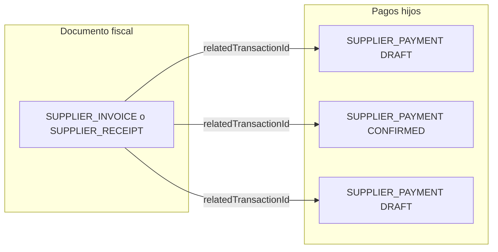

# Plan: eliminar `PAYMENT_OUT` y modelar compromisos / estado en factura-boleta

## Contexto del problema

- [`supplier-payments.controller.ts`](backend/src/modules/transactions/presentation/supplier-payments.controller.ts) fuerza `PAYMENT_OUT` en `POST`, pero [`CreateTransactionDto.validate()`](backend/src/modules/transactions/application/dto/create-transaction.dto.ts) **rechaza** cualquier `PAYMENT_OUT` al inicio (deprecación). Eso deja el flujo **incoherente** (y el banco→caja vía [`CreateBankTransferDto`](backend/src/modules/transactions/application/dto/create-transaction.dto.ts) también arma `PAYMENT_OUT` y chocaría con la misma validación si pasa por `TransactionsService.createTransaction`).
- En dominio ya existe [`SUPPLIER_PAYMENT`](backend/src/modules/transactions/domain/transaction.entity.ts) y enums de pago reutilizables: [`PaymentMethod`](backend/src/modules/transactions/domain/transaction.entity.ts) (CASH, TRANSFER, CHECK, …) y [`PaymentStatus`](backend/src/modules/transactions/domain/transaction.entity.ts) (`PENDING`, `PARTIAL`, `PAID`, `OVERDUE`, `VOIDED`). [`TransactionStatus`](backend/src/modules/transactions/domain/transaction.entity.ts) (`DRAFT`, `CONFIRMED`, …) sirve para **compromiso vs ejecutado** en la misma fila de transacción.

Tu modelo (N `SUPPLIER_PAYMENT` como compromisos, cada uno con estado propio, factura con agregado parcial/completo/pendiente) encaja con:

- **Compromiso**: `SUPPLIER_PAYMENT` con `status = DRAFT` (alineado con el listado actual que usa `DRAFT` cuando `includePaid=false` en el controller de proveedores).
- **Ejecutado**: al completar, pasar a `CONFIRMED` y generar `PAYMENT_EXECUTION` como hoy, pero enlazando al **pago fuente** correcto (ya no asumir solo `PAYMENT_OUT`).

**Recomendación de agregado en factura/boleta (sin pregunta respondida):** empezar con **estado calculado** en lectura (servicio/query: suma `total`/`amountPaid` por hijos y `TransactionStatus`) para evitar desincronización; si más adelante hace falta performance en listados masivos, persistir `paymentStatus` en el padre y actualizarlo en el mismo use case que confirma pagos.

## Paso 1: Inventario y separación semántica de `PAYMENT_OUT`

Hoy `PAYMENT_OUT` cubre al menos:

| Uso | Evidencia | Destino propuesto |
|-----|-----------|-------------------|
| Pago proveedor / CxP | [`accounting-rules.seed.ts`](backend/src/modules/accounting-rules/domain/accounting-rules.seed.ts) regla "Payment Out (Supplier)", [`AccountingEngine`](backend/src/shared/application/AccountingEngine.ts) rama `2.1.01` | **`SUPPLIER_PAYMENT`** |
| Banco → caja (`metadata.bankToCashTransfer`) | [`CreateBankTransferDto`](backend/src/modules/transactions/application/dto/create-transaction.dto.ts), regla seed "Bank to Cash Transfer" | **Nuevo `TransactionType`** (p. ej. `BANK_TO_CASH_TRANSFER`) con mismas reglas/metadata |
| Fallback en cuotas | [`installment.service.ts`](backend/src/modules/installments/application/services/installment.service.ts) `default: PAYMENT_OUT` | **`throw`** o mapeo explícito a tipo correcto |
| Tests / docs | varios `.md`, `accounting-integration.spec.ts` | Actualizar a tipos finales |

## Paso 2: Nuevo tipo para tesorería (reemplazo del `PAYMENT_OUT` sin proveedor)

- Añadir en [`transaction.entity.ts`](backend/src/modules/transactions/domain/transaction.entity.ts) un tipo explícito (nombre a acordar en código: `BANK_TO_CASH_TRANSFER` o similar), documentar que reemplaza `PAYMENT_OUT` + `metadata.bankToCashTransfer`.
- Actualizar [`CreateBankTransferDto.toCreateTransactionDto`](backend/src/modules/transactions/application/dto/create-transaction.dto.ts) para usar ese tipo (manteniendo `metadata.bankToCashTransfer` si simplifica reglas contables existentes, o migrar condición a `transactionType`).
- Duplicar/ajustar ramas en [`AccountingEngine.ts`](backend/src/shared/application/AccountingEngine.ts) donde hoy `transaction.transactionType === 'PAYMENT_OUT'` discrimina transferencias de venta vs CxP: incluir el nuevo tipo en la rama “banco/caja interno”, y **no** mezclar con proveedor.
- Actualizar [`accounting-rules.seed.ts`](backend/src/modules/accounting-rules/domain/accounting-rules.seed.ts): regla "Bank to Cash Transfer" de `PAYMENT_OUT` → nuevo tipo; regla "Payment Out (Supplier)" → `SUPPLIER_PAYMENT`.

## Paso 3: API proveedores y validación DTO

- [`supplier-payments.controller.ts`](backend/src/modules/transactions/presentation/supplier-payments.controller.ts): `POST` y `GET` deben usar **`SUPPLIER_PAYMENT`**, no `PAYMENT_OUT`. El filtro `includePaid` debe interpretarse sobre `DRAFT` vs `CONFIRMED` (o la convención que ya use el front).
- [`create-transaction.dto.ts`](backend/src/modules/transactions/application/dto/create-transaction.dto.ts):
  - **Quitar** el bloque `case TransactionType.PAYMENT_OUT` de validaciones específicas (o dejarlo solo durante migración con mensaje claro).
  - Ajustar mensaje de `PAYMENT_EXECUTION`: `relatedTransactionId` debe referenciar el **documento de pago origen** (`SUPPLIER_PAYMENT`, u otros tipos salientes que completen con ejecución), no “solo PAYMENT_OUT”.
  - **`SUPPLIER_PAYMENT` + documento fiscal**: hoy el error dice `relatedTransactionId (PURCHASE)`; ampliar validación (y tests en [`create-transaction.dto.spec.ts`](backend/src/modules/transactions/tests/unit/create-transaction.dto.spec.ts)) para aceptar IDs cuyo `transactionType` sea uno de: `PURCHASE`, `SUPPLIER_INVOICE`, `SUPPLIER_RECEIPT`, `SUPPLIER_HONORARIUM_RECEIPT` (misma `supplierId` que el pago). La verificación estricta puede ser **async** en el handler de creación si el DTO sigue siendo sync (o validación liviana en DTO + comprobación en use case).

## Paso 4: Completar pago y `PAYMENT_EXECUTION`

- Unificar lógica duplicada entre [`complete-payment.usecase.ts`](backend/src/modules/transactions/application/commands/complete-payment.usecase.ts) y [`complete-supplier-payment.handler.ts`](backend/src/modules/transactions/application/handlers/commands/complete-supplier-payment.handler.ts): aceptar **`SUPPLIER_PAYMENT`** (y, si aplica, otros egresos que compartan el mismo patrón de “borrador → confirmado + ejecución”).
- Metadata: renombrar o extender claves (`paymentOutId` → `sourcePaymentId` o mantener alias leyendo ambos durante un periodo) para no romper reportes; documentar en el plan de migración SQL si se reescriben JSON.

## Paso 5: Ledger, cash session, bank movements, queries

Archivos representativos a tocar en bloque:

- [`ledger-entries.service.ts`](backend/src/modules/ledger-entries/application/ledger-entries.service.ts) y [`generate-ledger-entries.command.ts`](backend/src/modules/ledger-entries/application/commands/generate-ledger-entries.command.ts): validación `PAYMENT_EXCEEDS_DEBT` hoy solo en `PAYMENT_OUT` + `supplierId` → incluir **`SUPPLIER_PAYMENT`**.
- [`get-supplier-payment-context.handler.ts`](backend/src/modules/transactions/application/handlers/queries/get-supplier-payment-context.handler.ts): filtro y columnas (`tx.amount` vs `total` / `amountPaid`) corregidos; tipo `SUPPLIER_PAYMENT`; estados coherentes con `DRAFT`/`CONFIRMED` (hoy filtra `PENDING` que puede no coincidir con el ORM).
- [`get-movements-for-session.query.ts`](backend/src/modules/transactions/application/queries/get-movements-for-session.query.ts), [`cash-session-core.service.ts`](backend/src/modules/cash-sessions/application/cash-session-core.service.ts), [`cash-sessions.service.ts`](backend/src/modules/cash-sessions/application/cash-sessions.service.ts), [`bank-movements.service.ts`](backend/src/modules/bank-movements/application/bank-movements.service.ts): mapear egresos a **`SUPPLIER_PAYMENT`** + nuevo tipo tesorería.
- [`transactions.controller.ts`](backend/src/modules/transactions/presentation/transactions.controller.ts) (strings OpenAPI), [`pwa-admin/.../transaction-types.ts`](pwa-admin/src/features/transactions/types/transaction-types.ts), [`pwa-pos/.../CashMovementsPageClient.tsx`](pwa-pos/src/app/(pos)/cash/movements/ui/CashMovementsPageClient.tsx).

## Paso 6: Migración de datos (SQL / TypeORM migration)

Script único (orden sugerido):

1. `UPDATE transactions SET transactionType = 'SUPPLIER_PAYMENT' WHERE transactionType = 'PAYMENT_OUT' AND supplierId IS NOT NULL AND COALESCE(metadata->>'bankToCashTransfer','false') != 'true'`.
2. `UPDATE transactions SET transactionType = 'BANK_TO_CASH_TRANSFER' WHERE transactionType = 'PAYMENT_OUT' AND COALESCE((metadata->>'bankToCashTransfer')::text,'false') IN ('true','True')` (ajustar según formato real del JSON).
3. Caso restante (p. ej. solo `employeeId`, sin proveedor): decidir mapa a **`EXPENSE_PAYMENT`** / flujo nómina según datos reales en producción; revisar filas huérfanas antes de borrar el valor del enum en código.
4. `UPDATE accounting_rules SET transactionType = 'SUPPLIER_PAYMENT' WHERE transactionType = 'PAYMENT_OUT' AND name ILIKE '%supplier%'` (o por condición exacta); análogo para banco→caja.
5. Opcional: backfill `relatedTransactionId` en pagos viejos si hoy apuntan mal.

## Paso 7: Estado de pago en factura / boleta

- Implementar un **servicio de lectura** (p. ej. en módulo `transactions` o `supplier-invoices`) que, dado `documentTransactionId`:
  - Liste hijos `transactionType = 'SUPPLIER_PAYMENT'` con `relatedTransactionId = documentId`.
  - Calcule: `totalDocument`, `sumPaidConfirmed`, `sumPendingDraft`, conteos por estado.
  - Devuelva un DTO con agregado: `NONE | SCHEDULED | PARTIAL | PAID` (nombres alineados a `PaymentStatus` del padre si se reutiliza) + detalle por línea.
- Exponerlo en el handler/query que ya arma el detalle de factura/boleta (revisar [`supplier-invoices.controller.ts`](backend/src/modules/supplier-invoices/presentation/supplier-invoices.controller.ts) y equivalente receipts) sin obligar a duplicar estado en BD en la primera iteración.

**Relación con `installments`:** el modelo de cuotas en [`installment.entity.ts`](backend/src/modules/installments/domain/installment.entity.ts) ya tiene `InstallmentStatus` (`PENDING`/`PARTIAL`/`PAID`). Si además crean N `SUPPLIER_PAYMENT` por plan, definir regla de negocio explícita: **o** cuotas son la única fuente del plan y el pago crea una sola transacción por imputación, **o** las cuotas se generan desde los compromisos `SUPPLIER_PAYMENT` en DRAFT — evitar doble verdad sin sincronización.

## Paso 8: Tests y limpieza final

- Actualizar [`accounting-integration.spec.ts`](backend/test/integration/accounting-integration.spec.ts) y [`create-transaction.dto.spec.ts`](backend/src/modules/transactions/tests/unit/create-transaction.dto.spec.ts).
- Eliminar `PAYMENT_OUT` del enum TypeScript y de todos los `switch` cuando no queden filas ni reglas; si queda riesgo, fase intermedia: mantener valor en DB migrado y **solo** quitar del código tras verificación.
- Revisar [`products.service.ts`](backend/src/modules/products/application/products.service.ts) mapa de tipos y seeds.

## Riesgos y mitigaciones

- **Contabilidad histórica**: reglas y asientos ya generados referencian `transactionId`; cambiar solo `transactionType` en filas no invalida asientos, pero sí informes que filtren por tipo — actualizar queries.
- **Front**: cualquier filtro hardcodeado a `PAYMENT_OUT` debe pasar a `SUPPLIER_PAYMENT` + nuevo tipo de tesorería.
- **Payroll tests que usaban `PAYMENT_OUT`**: reasignar a tipo correcto para no mezclar semántica de proveedor con sueldos.
