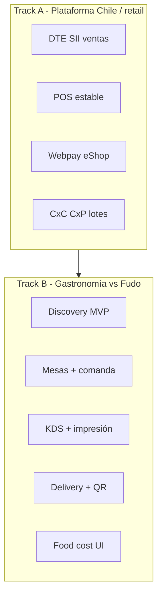
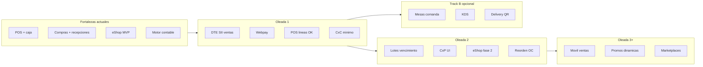

# Análisis competitivo: Bsale, Fudo y KaiStore (flow-store-2)

Documento de referencia interna que contrasta el posicionamiento de **Bsale** (retail / ventas + DTE) y **Fudo** (gastronomía / POS salón) con el estado real del monorepo **KaiStore / flow-store-2**, y propone prioridades de producto en un roadmap integrado.

**Última revisión:** mayo 2026  
**Alcance del repo:** `backend`, `pwa-admin`, `pwa-pos`, `pwa-stock`, `pwa-eshop`  
**Fuentes:** `Análisis Competitivo ERP Bsale.md`, `Análisis Competitivo Fudo para KaiStore.md`
 que no 
---

## 1. Resumen ejecutivo

KaiStore compite en **dos frentes distintos**:

| Competidor | Qué es | Relación con KaiStore |
|------------|--------|------------------------|
| **Bsale** | Ventas + inventario transaccional + DTE Chile (Pymes retail) | KaiStore es **más ERP** pero **sin DTE ventas** — gap bloqueante en Chile |
| **Fudo** | POS gastronómico cloud (~30k locales LATAM): mesas, comandas, KDS, delivery | KaiStore **no tiene vertical salón**; Bsale tampoco (alianzas Fudo/Toteat) |

**Bsale** no compite como ERP completo. **Fudo** no compite en compras/contabilidad. **KaiStore** es un ERP operativo amplio (admin, POS retail, stock, eShop, contabilidad, compras) con huecos en **emisión fiscal de ventas**, **cobro online** y — si el segmento restaurante es prioritario — en **mesas, comandas y KDS**.

| Dimensión | Bsale | Fudo | KaiStore (este repo) |
|-----------|--------|------|----------------------|
| **Promesa** | Vender rápido y facturar (SII) | Operar el salón y la cocina | Operar el negocio end-to-end |
| **Fortaleza** | POS, DTE, onboarding simple | Mesas, KDS, delivery apps, DTE Chile incluido | Compras, stock, contabilidad, eShop propio, recetas (BOM) |
| **Debilidad** | Compras, lotes, e-commerce caro | Sync caja móvil, recetas, APIs beta | Sin DTE ventas, sin vertical gastronomía |
| **ICP típico** | Retail, ferretería, tienda | Restaurante, bar, dark kitchen | Retail + back-office; restaurante solo con Track B |

---

## 2. Posicionamiento de Bsale (síntesis del análisis fuente)

Bsale se posiciona como **sistema de ventas** con control de inventario y facturación electrónica, no como ERP de back-office completo. Pilares comerciales típicos:

- Sin comisiones sobre ventas procesadas.
- Usuarios ilimitados en planes.
- Arriendo mensual sin contrato largo obligatorio.
- SaaS multiplataforma (web + apps).

**Fortalezas funcionales:**

- POS rápido (código de barras, descuentos, cierres de caja).
- DTE integrado (Chile, Perú, México).
- Cotizaciones, cobranza a crédito, fidelización por puntos.
- e-commerce y omnicanal vía planes e integradores.

**Debilidades estructurales (oportunidad para KaiStore):**

- Inventario transaccional, sin WMS avanzado ni **lotes/vencimiento**.
- Compras rudimentarias (“factura de compra” fiscal, no OC con aprobaciones ni reorden).
- Shopify/WooCommerce sin conector nativo gratuito (costo de integradores ~USD 20–45/mes).
- App móvil limitada para venta en terreno.
- Promociones por packs estáticos, no reglas dinámicas por familia de variantes.
- Gastronomía solo vía alianzas (Fudo, Toteat) = doble suscripción.

---

## 2bis. Posicionamiento de Fudo (gastronomía)

Fudo (Anser Indicus S.A.) es un **POS gastronómico cloud**, no un ERP. Unifica toma de pedidos, caja, inventario básico de insumos y canales de entrega. Opera en web + apps Android/iOS; impresoras térmicas por USB, Bluetooth o red.

### 2bis.1 Módulos operativos Fudo

| Módulo | Función |
|--------|---------|
| **Salón** | Mesas, comandas móvil, KDS, cuenta por comensal |
| **Caja** | Arqueos, gastos, cuentas corrientes proveedor (limitado) |
| **Inventario** | Stock ingredientes, alertas, mermas (recetas débiles según usuarios) |
| **Canales** | Carta QR, tienda online (*Tu Delivery*), integración PedidosYa / Uber / Rappi |

### 2bis.2 Modelo de precios (Chile, referencia)

Plan base **Avanzado ~$34.500 CLP/mes** incluye POS, caja, carta QR y **DTE SII sin costo de emisión**. Módulos adicionales típicos:

| Módulo | CLP/mes (aprox.) |
|--------|------------------|
| Gestión de mesas | $4.500 |
| Monitor cocina (KDS) | $9.500 |
| Delivery apps | $9.500 |
| Ventas por comensal | $4.500 |
| Terminal Fudo (hardware) | Arriendo $0; comisiones 2,79%–5,99% + IVA |

Un local con salón + cocina + delivery puede pagar **~$58.000+ CLP/mes** antes de terminal. En Colombia el patrón es similar (plan base ~$118.900 COP + add-ons).

### 2bis.3 Fortalezas y debilidades Fudo (oportunidad KaiStore)

**Fortalezas:** flujo salón maduro, DTE Chile integrado, hub delivery, KDS, carta QR, documentos recibidos XML en plan Pro.

**Debilidades reportadas por usuarios (vulnerabilidades a explotar):**

| Vulnerabilidad | Síntoma | Oportunidad KaiStore |
|----------------|---------|----------------------|
| Soporte no 24/7 | Caídas en horario nocturno sin respuesta | SLA / soporte extendido (operaciones + producto estable) |
| Cierre móvil ≠ caja | Ventas cerradas en app no aparecen en arqueo | Cola de eventos + sync idempotente caja ↔ dispositivo |
| Sin stock en comanda mesero | Pedidos de platos agotados | `stock-levels` visible al comandar |
| Modificadores se resetean | Con alerta de stock mínimo se pierden adicionales | UX comanda + reglas de alerta sin borrar línea |
| Sin copiar adicionales | Misma mesa, mismos extras, re-ingreso manual | Duplicar línea / copiar modificadores |
| Impresión duplicada | Comandas 2×–3× en cocina | Confirmación impresora + cola única (`print-service`) |
| Recetas malas | Food cost impreciso | Módulo `recipes` (BOM) + UI + descuento al vender |
| APIs en beta | Pedidos por email a soporte | API pública documentada (post-DTE) |
| Onboarding SII largo | Videollamada 1h + certificado .pfx | Wizard autónomo (misma meta que vs Bsale) |
| Sin auditoría emisor DTE | No se ve qué cajero emitió | Trazabilidad usuario en emisión fiscal |

**Nota Bsale ↔ Fudo:** muchos restaurantes usan **Fudo + Bsale** (o facturador externo). KaiStore puede aspirar a **un solo sistema** solo si cierra Oleada 1 (DTE) y Track B (salón).

---

## 3. Arquitectura KaiStore en el monorepo

### 3.1 Aplicaciones

| App | Puerto dev | Propósito |
|-----|------------|-----------|
| **backend** | 3030 | API NestJS, CQRS/DDD, PostgreSQL, OpenAPI |
| **pwa-admin** | 3031 | ERP web: catálogo, ventas, compras, inventario, contabilidad, tesorería, e-shop admin |
| **pwa-pos** | 3032 | Punto de venta, caja, cotizaciones, recepciones |
| **pwa-stock** | 3033 | Inventario móvil: escaneo, ajustes, transferencias |
| **pwa-eshop** | 3034 | Tienda pública (un deploy = una tienda), catálogo, carrito, checkout |

### 3.2 Dominios backend (agrupación)

| Dominio | Módulos representativos |
|---------|-------------------------|
| **Ventas / POS** | `cash-sessions`, `points-of-sale`, `transactions`, `quotations`, `promotions`, `price-lists`, `customers`, `installments` |
| **Inventario** | `inventory`, `stock-levels`, `storages`, `stock-realtime` |
| **Compras** | `suppliers`, `receptions`, `purchasing-supplier-documents`, `supplier-invoices`, `supplier-receipts`, … |
| **Contabilidad / tesorería** | `accounting`, `ledger-entries`, `accounting-rules`, `bank-*`, `checks`, `treasury-accounts`, … |
| **Catálogo** | `products`, `product-variants`, `categories`, `brands`, `attributes`, `recipes` |
| **eShop** | `e-shop` (API pública + admin: catálogo, checkout, hero, testimonios) |
| **Plataforma** | `companies`, `users`, `permissions`, `branches`, `automation`, `multimedia` |
| **Gastronomía** | ❌ No hay módulos `tables`, `kitchen-orders`, `kds` ni PWA mesero |

### 3.3 Activos reutilizables para vertical restaurante

| Activo actual | Uso potencial vs Fudo |
|---------------|------------------------|
| `pwa-pos` + `cash-sessions` | Cobro final, arqueo, medios de pago |
| `products` / `variants` / `attributes` | Menú, modificadores, platos |
| `recipes` (PREPARADO, ELABORADO, BOM) | Food cost — Fudo débil aquí |
| `stock-levels`, `pwa-stock` | Insumos, conteos, recepciones |
| `receptions`, `suppliers`, compras | Ventaja vs Fudo Pro (XML proveedor) |
| `e-shop` | Pedido takeaway / menú web (adaptar UX menú) |
| `print-service-client` en POS | Extender a comandas y tickets cocina |
| `promotions` | Descuentos sala (con cuidado en modificadores) |

---

## 4. Matriz funcional comparativa

### 4.1 Donde Bsale gana hoy

| Capacidad | Notas |
|-----------|--------|
| **DTE SII en ventas** | Boleta, factura, NC/ND en POS y e-commerce |
| **POS mostrador maduro** | Cierres, arqueo, medios de pago |
| **Omnicanal vía integradores** | Shopify, WooCommerce, marketplaces (con costo extra) |
| **Fidelización** | Puntos nativos |
| **Simplicidad Pyme** | Menos superficie que un ERP completo |

### 4.2 Donde KaiStore va adelante

| Capacidad | Evidencia en repo |
|-----------|------------------|
| **Compras estructuradas** | `PURCHASE_ORDER`, recepciones, `PurchaseDocumentBuilder`, DTE compra en metadata |
| **ERP back-office** | Plan de cuentas, reglas, ledger, bancos, cheques, presupuestos, RRHH |
| **eShop nativo** | `pwa-eshop` + `GET/POST /e-shop/*` sin integrador de terceros |
| **Multi-sucursal / bodega** | `branches`, `storages`, scoping en transacciones |
| **Cotizaciones** | `quotations` + conversión a venta; POS y admin |
| **Promociones** | `promotions` admin + POS |
| **Listas de precio** | `price-lists`, lista eShop por defecto |
| **Stock móvil** | `pwa-stock` con escaneo |

### 4.3 Huecos críticos en KaiStore

| Hueco | Impacto |
|-------|---------|
| **Sin emisión DTE SII en ventas** | POS usa documento tipo `TICKET`; no sustituye Bsale en Chile sin integración fiscal |
| **Sin Webpay / pasarela en eShop** | Checkout crea venta; no cobra online (ver `docs/KAISTORE_E-SHOP_PHASE2_BACKLOG.md`) |
| **CxP / CxC / EEFF en admin** | Varias rutas con `ErpPlaceholderPage` |
| **Sin lotes / vencimiento en stock** | Excluye perecederos (alimentos, farmacia, cosmética) |
| **Sin Shopify / WooCommerce** | No hay conectores en código |
| **Sin fidelización** | Gap vs Bsale |
| **POS: líneas en sesión** | TODOs en `SalesFromSessionService` (add/update/delete línea) |
| **eShop fase 2** | Envíos, SEO, cuenta comprador, etc. en backlog |

### 4.4 Tabla resumen rápida (retail / ERP)

| Área | Bsale | KaiStore |
|------|-------|----------|
| DTE ventas (SII) | ✅ | ❌ |
| DTE / docs proveedor (compras) | ⚠️ Factura compra simple | ✅ Recepciones + tipos proveedor |
| POS + caja | ✅ | ✅ (con gaps en líneas) |
| Inventario básico | ✅ | ✅ |
| Lotes / vencimiento | ❌ | ❌ |
| OC / reorden compras | ❌ | ✅ backend; CxP UI pendiente |
| e-commerce propio | ✅ plan + integradores | ✅ eShop MVP |
| Contabilidad / nómina | ❌ (externo) | ✅ motor; UI parcial |
| Cotizaciones | ✅ | ✅ |
| API / webhooks | ✅ API; webhooks eventos | ✅ OpenAPI; webhooks salientes no |

### 4.5 Matriz gastronomía: Fudo vs KaiStore

| Capacidad | Fudo | KaiStore |
|-----------|------|----------|
| Mapa mesas / salón | ✅ (add-on) | ❌ |
| Comanda → cocina (KDS) | ✅ (add-on) | ❌ |
| App mesero | ✅ | ❌ |
| POS + caja gastronómica | ✅ | ⚠️ POS retail (`pwa-pos`) |
| DTE ventas Chile | ✅ incluido en plan | ❌ |
| Delivery agregadores | ✅ módulo | ❌ |
| Carta QR / menú digital | ✅ | ⚠️ eShop retail, no mesa QR |
| Recetas / food cost | ⚠️ débil (quejas usuarios) | ⚠️ `recipes` backend, sin flujo cocina |
| Compras proveedor (XML) | ✅ Plan Pro | ✅ más fuerte en backend |
| Contabilidad / CxP | ⚠️ limitado | ✅ motor; UI parcial |
| Impresión comandas | ✅ | ⚠️ print-service (tickets, no KDS) |
| Sync móvil ↔ arqueo caja | ❌ problema conocido | ❌ no diseñado salón |
| Offline comanda | ⚠️ parcial | ❌ |

**Conclusión 4.5:** KaiStore **no reemplaza Fudo hoy**. Compite mejor como ERP + compras + eShop; la paridad gastronómica requiere **Track B** (sección 6bis).

---

## 5. Alineación con recomendaciones del análisis Bsale

El documento fuente propone cinco ejes para un ERP alternativo. Estado en repo:

| Recomendación (doc Bsale) | Estado KaiStore | Prioridad sugerida |
|---------------------------|-----------------|-------------------|
| Conectores omnicanal nativos sin costo extra | eShop propio sí; marketplaces no | Después de DTE + Webpay |
| Cobro justo en onboarding (no cobrar hasta go-live fiscal) | Política comercial, no código | Producto / ventas |
| Lotes y vencimiento | No implementado | Oleada 2 |
| Mobile-first ventas en terreno | `pwa-stock` sí; ventas ruta no | Oleada 3 |
| Módulo compras estructurado (OC, CxP, reorden) | Backend fuerte; UI CxP placeholder | Oleada 2 |

### 5bis. Alineación con recomendaciones del análisis Fudo

| Recomendación (doc Fudo) | Estado KaiStore | Prioridad |
|--------------------------|-----------------|-----------|
| Soporte 24/7 / SLA | Operaciones, no código | Comercial; después de estabilidad producto |
| Offline-first móvil (SQLite + sync) | No implementado | Track B fase 4+ |
| UX comanda (stock visible, duplicar mods) | Requiere app salón nueva | Track B fase 2 |
| Onboarding DTE autónomo (~5 min) | Mismo gap que Bsale | **Oleada 1** (Track A) |
| KDS avanzado | No existe | Track B fase 3 |
| Plugins Shopify / WooCommerce | No en código | Oleada 4 (retail); menú delivery en Track B fase 6 |

---

## 6. Roadmap recomendado por oleadas (Track A — retail / Chile)

### Oleada 1 — Vender y cobrar legalmente (bloqueante Chile)

**Objetivo:** Paridad mínima con Bsale en el mercado chileno.

1. **Integración DTE / SII para ventas** — boleta, factura, NC/ND desde POS y eShop.
2. **Webpay (o pasarela local) en eShop** — ítem en `KAISTORE_E-SHOP_PHASE2_BACKLOG.md`.
3. **Completar POS en sesión** — líneas add/update/delete en `SalesFromSessionService`.
4. **CxC operativa mínima** — calendario vencimientos, pagos parciales (backend `installments` existe; UI placeholder).

**Por qué primero:** El cliente tipo Bsale pregunta “¿emite boleta?” antes que “¿tengo plan de cuentas?”.

---

### Oleada 2 — Ganar en operación y omnicanal

5. **eShop fase 2 priorizado** — envíos (`/e-shop/shipping`), SEO/sitemap, cross-sell API, admin destacados/variantes eShop.
6. **Inventario: lotes y vencimiento** — recepción, alertas, FEFO en salidas.
7. **UI Cuentas por pagar** — sustituir placeholder; pagos a proveedores, vencimientos.
8. **Reorden / OC sugerida** — umbrales en `stock-levels` → `PURCHASE_ORDER`.

**Argumento comercial:** “Tienda y compras profesionales incluidos, sin USD 45/mes de integrador Shopify”.

---

### Oleada 3 — Experiencia móvil y retención

9. **Ventas en terreno** — cotización/pedido offline-first (gap Bsale app).
10. **Promociones dinámicas por familia de variantes** (no solo packs estáticos).
11. **Fidelización básica** — si el segmento retail lo exige.

---

### Oleada 4 — Ecosistema y escala

12. Conectores **Shopify / WooCommerce / Mercado Libre** (post-DTE).
13. **Webhooks salientes** + API pública productizada.
14. **Gastronomía** — ver **Track B** (sección 6bis); no duplicar aquí salvo decisión de producto.
15. Electron PWA eShop, deep links, `app-versions` — backlog plataforma.

---

## 6bis. Track B — Vertical gastronomía (vs Fudo)

Solo ejecutar si negocio confirma segmento restaurante como prioridad. **Depende de Oleada 1 mínima** (DTE + POS estable): un restaurante chileno pregunta por boleta antes que por mapa de mesas.

### Fase B0 — Discovery (2–3 semanas)

- Entrevistas con locales que usan Fudo (Chile).
- Flujo MVP: abrir mesa → comandar → cocina → precuenta → cobro → cierre caja.
- Decisión: PWA mesero + KDS web vs app nativa; pricing vs Fudo modular.

**Entregable:** PRD `KaiStore Restaurante MVP` + wireframes.

### Fase B1 — MVP salón (10–14 semanas)

| # | Entrega |
|---|---------|
| B1.1 | Salas y mesas (libre / ocupada / cuenta) |
| B1.2 | Comanda por mesa (ítems, notas, envío cocina) |
| B1.3 | **Sync caja garantizada** (eventos idempotentes; respuesta a fallo Fudo) |
| B1.4 | Stock visible al comandar |
| B1.5 | Modificadores estables (sin reset por alertas) |

**Fuera de MVP:** KDS completo, agregadores delivery, mapa drag-and-drop, terminal pagos.

**Criterio de salida:** piloto opera una cena completa sin Fudo en salón.

### Fase B2 — Cocina e impresión (8–10 semanas)

- KDS (cola, tiempos, estados).
- Ruteo impresión barra/cocina/postre (`print-service`).
- Anti-duplicado comandas.
- Duplicar adicionales entre líneas.

### Fase B3 — Cuenta y comensal (6–8 semanas)

- División por comensal, precuenta, cobro desde mesa (DTE Oleada 1).
- Propina / medios de pago (terminal después).

### Fase B4 — Inventario gastronómico (8–12 semanas)

- UI recetas + descuento automático al vender plato.
- Lotes / vencimiento insumos (también Oleada 2 retail).
- Food cost y márgenes por plato.
- UI recepción XML proveedor.

### Fase B5 — Canales digitales (10–14 semanas)

- Menú online / takeaway (eShop o módulo menú).
- API pedidos estable (inyección POS + KDS).
- Integración 1 agregador (ej. PedidosYa) o pedido web propio.
- Carta QR.

### Fase B6 — Escala (continuo)

- Offline-first completo si pilotos lo exigen.
- Más agregadores, terminal propia, multi-sucursal dark kitchen.

**Estimación orden de magnitud:** MVP salón B1 ≈ 2 dev full-time × 3 meses + diseño + 1 piloto.

---

## 6ter. Priorización integrada (Bsale + Fudo)

| Prioridad | Tema | Competidor |
|-----------|------|------------|
| **P0** | DTE SII ventas | Bsale + Fudo |
| **P0** | POS estable (líneas sesión) | Bsale + base Fudo |
| **P1** | Webpay + eShop envíos | Bsale |
| **P1** | Discovery + PRD gastronomía | Fudo (si segmento activo) |
| **P2** | MVP mesas + comanda + sync caja | Fudo |
| **P2** | Lotes/vencimiento + recetas UI | Bsale + Fudo |
| **P3** | KDS + impresión comandas | Fudo |
| **P3** | CxP UI | Bsale |
| **P4** | Delivery hub + menú QR | Fudo |
| **P5** | Shopify/WooCommerce, fidelización | Bsale |

---

## 7. Qué no hacer primero

Para no diluir esfuerzo ni vender “ERP complejo” sin cerrar el núcleo anti-Bsale:

- RRHH / remuneraciones / presupuestos avanzados como prioridad comercial Pyme.
- Contabilidad completa (asientos manuales, conciliación bancaria UI) antes que DTE ventas.
- Integración Shopify **antes** de DTE Chile.
- Copiar pricing Bsale (UF + microservicios) sin paridad fiscal + POS estable.
- **Competir con Fudo** solo con “mejor ERP” sin mesas/KDS (el dueño del bar no compra plan de cuentas en hora punta).
- **KDS + mesas + DTE + Shopify** en un solo release.
- Prometer **soporte 24/7** antes de producto estable en salón y caja.
- **Track B completo** antes de cerrar Oleada 1 (DTE ventas).

---

## 8. Diagrama de dependencias (resumen)

---

## 9. Mensaje estratégico sugerido

### 9.1 vs Bsale (retail / Pyme)

**No competir como:** “ERP con más pantallas que Bsale”.

**Sí competir como:** “Operación real (compras, stock, contabilidad, tienda propia) **más** facturación y cobro Chile cuando Oleada 1 esté cerrada”.

Hoy: **más ERP del que Bsale promete, pero sin el pilar DTE ventas que define a Bsale en Chile**.

### 9.2 vs Fudo (gastronomía)

**Hoy (honesto):** KaiStore es más fuerte en **compras, stock, contabilidad y tienda**; no sustituye Fudo en salón ni cocina.

**Futuro (Track A + B):** “Misma boleta que Fudo, pero caja que cuadra, cocina sin tickets triples, insumos y compras en un solo sistema — sin pagar Fudo + Bsale + integrador.”

Eso es creíble solo tras **Oleada 1 + Fase B1 + B2** como mínimo.

### 9.3 Escenario “doble stack” actual del mercado

Muchos restaurantes pagan **Fudo (~$35k–58k) + facturador/ERP**. KaiStore puede capturar el segundo rol solo con DTE; para capturar el primero hace falta Track B o alianza (no implementada en repo).

---

## 10. Referencias en el repositorio

| Documento / ruta | Contenido |
|------------------|-----------|
| `docs/KAISTORE_ROADMAP.md` | **Roadmap de producto** (P1–P6 núcleo; Webpay y SII al final) |
| `Análisis Competitivo ERP Bsale.md` | Análisis estratégico fuente (Bsale) |
| `Análisis Competitivo Fudo para KaiStore.md` | Análisis estratégico fuente (Fudo) |
| `backend/src/modules/recipes/` | BOM / recetas (PREPARADO, ELABORADO) |
| `pwa-pos` + `print-service-client` | Base POS e impresión |
| `docs/KAISTORE_E-SHOP_DEVELOPMENT_GUIDE.md` | Guía desarrollo eShop |
| `docs/KAISTORE_E-SHOP_PHASE2_BACKLOG.md` | Backlog tienda post-MVP |
| `pwa-admin/docs/CONTABILIDAD_SECCIONES.md` | Secciones contables y placeholders |
| `backend/docs/SALE_TRANSACTION_FLOW.md` | Flujo ventas |
| `README.md` | Puertos y arranque monorepo |

---

## 11. Próximos pasos sugeridos (gestión de producto)

### Track A (retail / Bsale)

- [ ] Definir proveedor DTE (LibreDTE, Haulmer, otro) y alcance MVP (boleta + factura + NC).
- [ ] Epic “Oleada 1” en tracker con issues por app (`backend`, `pwa-pos`, `pwa-eshop`, `pwa-admin`).
- [ ] Cerrar placeholders CxP/CxC con diseño UX mínimo antes de ampliar contabilidad.
- [ ] Revisar pricing/comercial vs “costo real Bsale + integrador Shopify”.

### Track B (gastronomía / Fudo) — si aplica

- [ ] Decisión explícita: ¿restaurante es prioridad 2026 o solo estrategia documental?
- [ ] Si sí: kickoff Fase B0 (entrevistas) en **paralelo** a Oleada 1, no en lugar de DTE.
- [ ] Definir arquitectura: nueva PWA (`pwa-restaurant`) vs extensión `pwa-pos`.
- [ ] Piloto con 1 local; métricas: descuadre caja, tiempo comanda, tickets duplicados.

### Documentación

- [ ] Actualizar este documento cuando Oleada 1 tenga fecha o scope cerrado.
- [ ] Tras decisión Track B: anotar fecha de inicio Fase B1 y equipo asignado.
