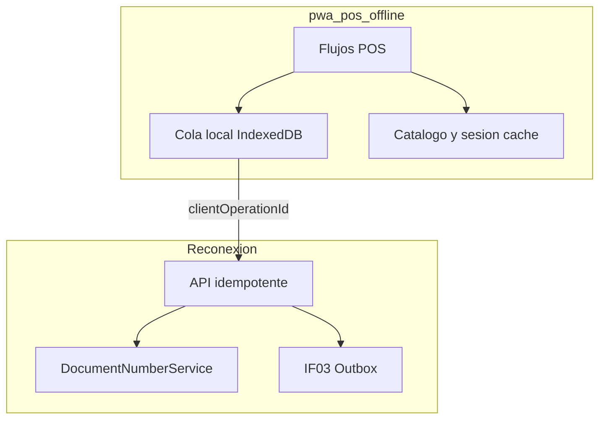

# IF-02 · POS offline-first — operación completa sin red

| Campo | Valor |
|-------|-------|
| **ID** | IF-02 |
| **Estado** | Diseño |
| **Prioridad** | P0 |
| **Última revisión** | junio 2026 |
| **Tareas** | [ROADMAP.md § IF-02](./ROADMAP.md#if-02--pos-offline-first) |

---

## 1. Resumen ejecutivo

Hoy `pwa-pos` es **online-first**: el carrito vive en el cliente, pero cada operación de negocio (venta, cobro, devolución, cierre de caja, etc.) requiere conectividad al backend NestJS. En retail chileno, la WiFi de tienda es inestable y es habitual tener **varios puntos de venta** en la misma sucursal.

Esta implementación futura define la estrategia para que **todo el POS sea operativo offline**: el cajero puede seguir trabajando sin red y las operaciones se sincronizan al reconectar, sin duplicar folios ni corromper stock ni sesiones de caja.

| Aspecto | Hoy (online) | Objetivo (IF-02) |
|---------|--------------|------------------|
| Venta / cobro | `POST /cash-sessions/sales` atómico | Cola local → sync idempotente |
| Folio documento | `DocumentNumberService` en servidor | Provisional offline; oficial al sync |
| Catálogo / stock | API + WebSocket realtime | Snapshot local + reconciliación |
| Multi-POS | Servidor serializa folios | `clientOperationId` + servidor |
| Impresión ticket | print-service local (IF-01) | Sigue local; folio provisional en ticket |

**Principio rector:** si el cajero puede hacerlo hoy en `pwa-pos` con red, debe poder hacerlo offline mañana (con sincronización posterior).

---

## 2. Problema que resuelve

1. **Corte de red en un solo POS** mientras otros siguen vendiendo → riesgo de folios duplicados si el offline genera correlativos localmente.
2. **Pérdida de ventas** si el POS deja de funcionar sin internet.
3. **Inconsistencia de stock** entre POS offline, POS online y eShop (cuando esté activo).
4. **Sesión de caja** abierta offline: movimientos, depósitos al hub y cierre deben cuadrar al sync.

Sin diseño explícito, un “modo offline parcial” (solo venta contado) deja al negocio a medias: crédito, devoluciones, cobranza y caja quedarían bloqueados.

---

## 3. Contexto en el monorepo

```
pwa-pos (offline)
    │
    ├── IndexedDB: cola de comandos + cache catálogo/sesión
    ├── Service Worker (opcional): assets + detección red
    │
    │  sync (reconexión)
    ▼
Backend API (idempotente)
    │
    ├── DocumentNumberService → folio oficial
    ├── sales-from-session.service → ventas, cobros, devoluciones
    └── IF-03 outbox → stock, contabilidad async
```

| Componente existente | Ubicación | Implicación IF-02 |
|---------------------|-----------|-------------------|
| Venta atómica POS | `POST /cash-sessions/sales` | Wrapper sync con `clientOperationId` |
| Folios correlativos | `backend/.../document-number.service.ts` | **No** llamar desde cliente offline |
| Secuencias DB | `document_sequences` + `FOR UPDATE` | Solo servidor asigna folio oficial |
| Cobro AR | `collect-pending-sales` | Comando en cola offline |
| Devoluciones / NC | `confirm-customer-return-*` | Comando en cola offline |
| Crédito / cuotas | IF-05 (UI incompleta) | Offline tras IF-05 online |
| CxP desde POS | IF-04 (no existe UI) | Offline tras IF-04 online |
| Impresión | IF-01 / print-service-client | Ticket con folio **provisional** |
| Mensajería servidor | IF-03 | Absorbe picos al sync masivo |

---

## 4. Superficie POS a cubrir offline

Inventario según rutas actuales de `pwa-pos`:

| Módulo | Ruta / flujo | Estado hoy | Offline IF-02 |
|--------|----------------|------------|---------------|
| Venta + cobro | `/pos`, `/pos/payment` | Online | F2 |
| Venta sin cobro (crédito) | `deferPayment` en cobro | Online | F3 (IF-05) |
| Cobro ventas pendientes (AR) | Cliente → Cobrar → `mode=collect` | Online | F3 |
| Cobro cuotas | `/pos/credit-payment` | Placeholder (IF-05) | F3 |
| Devoluciones + reembolso NC | `PosPaymentWorkspace` modos return / nc-payout | Online | F3 |
| Encargos / abonos | `BackorderDepositDialog` | Online | F3 |
| Cotizaciones | `SaveAsQuotationDialog` | Online | F3 |
| Clientes (búsqueda, ficha) | `/customers` | Online | F2 (cache) |
| Catálogo / stock POS | búsqueda + alertas WS | Online | F2 (snapshot) |
| Movimientos caja | `/cash/movements` | Online | F2 |
| Hub depósito / retiro | `/cash/hub-deposit`, `hub-withdrawal` | Online | F2 |
| Cierre caja | `/cash/closing` | Online | F2 |
| Recepción compra | `/purchasing/receptions/new` | Online | F3 |
| Cuentas por pagar | — (IF-04) | No existe | F3 (IF-04) |
| Impresión tickets | print-service local | Parcial | F2 (folio prov.) |
| Login / setup sesión | `/login`, `/setup`, `/opening` | Online | F1 |

---

## 5. Arquitectura cliente

### 5.1 Cola local (IndexedDB)

Cada operación de negocio se persiste como **comando** antes de intentar envío:

```typescript
type PosOfflineCommand = {
  clientOperationId: string;   // UUID v4, generado en cliente
  commandType: PosCommandType; // SALE | COLLECT_AR | RETURN | ...
  payload: unknown;            // mismo shape que API online
  createdAt: string;           // ISO
  status: 'PENDING_SYNC' | 'SYNCING' | 'SYNCED' | 'FAILED' | 'CONFLICT';
  provisionalDocumentNumber?: string;
  serverDocumentNumber?: string;
  lastError?: string;
  retryCount: number;
};
```

**Reglas:**

- Un `clientOperationId` = una operación lógica (reintentos no duplican).
- UI muestra estado: pendiente de sync, sincronizado, error (reintentar / resolver).
- Orden de sync: FIFO por `createdAt`, salvo dependencias explícitas (ej. cierre caja tras ventas).

### 5.2 Cache local

| Store | Contenido | Refresh |
|-------|-----------|---------|
| `catalog` | variantes, precios, UOM | Al abrir sesión + pull periódico online |
| `stock_snapshot` | cantidad por variante/bodega POS | Al abrir sesión; delta al sync |
| `customers` | últimos N + búsqueda reciente | LRU + pull bajo demanda online |
| `session` | `cashSessionId`, POS, usuario | Persistido en `pos-context-storage` (extender) |
| `credit_limits` | límite/disponible por cliente | Snapshot; validación estricta al sync (IF-05) |

### 5.3 Detección de red

- `navigator.onLine` + heartbeat periódico al backend (`GET /health` o ping ligero).
- Indicador en topbar (distinto del icono print-service WiFi).
- Al pasar a online: worker de sync en background sin bloquear UI.

---

## 6. Estrategia de folios (multi-POS)

### 6.1 Problema

`DocumentNumberService.allocateNext()` asigna folios con bloqueo pesimista por `(branchId, transactionType, year)`. Si dos POS offline generaran `SALE-26-00042` localmente, al sync habría colisión.

### 6.2 Solución recomendada

| Momento | Folio en UI / ticket | Folio en BD |
|---------|----------------------|-------------|
| Offline (inmediato) | **Provisional:** `POS-{posIdShort}-{localSeq}` | No existe aún |
| Sync exitoso | Reemplazar en UI/recibo reimpreso | **Oficial:** `SALE-26-00042` vía servidor |
| Idempotencia | `clientOperationId` en header/body | Segundo POST = mismo resultado |

**No usar** rangos pre-asignados por caja salvo requisito fiscal explícito (desperdicia números y complica reasignación de equipos).

### 6.3 API de sync (propuesta)

```
POST /pos/sync/commands
Body: { clientOperationId, commandType, payload, deviceId, pointOfSaleId }
Response 200: { status: 'SYNCED', documentNumber, transactionId }
Response 409: { status: 'CONFLICT', reason, resolutionHint }
Response 202: { status: 'ACCEPTED' }  // si IF-03 outbox
```

El servidor debe registrar `clientOperationId` en tabla de idempotencia (única por `companyId`).

---

## 7. Stock y conflictos

### 7.1 Política offline (decisión de negocio)

| Opción | Comportamiento | Recomendación |
|--------|----------------|---------------|
| A — Optimista | Permite vender; reconcilia al sync | Retail con tolerancia a oversell puntual |
| B — Snapshot estricto | Bloquea si stock local = 0 | Menos riesgo; puede frustrar en offline largo |
| C — Reserva híbrida | Descuenta del snapshot local; sync confirma | **Recomendado** para F2 |

Al sync con stock insuficiente en servidor: estado `CONFLICT`; operador elige anular venta offline, ajustar líneas o forzar (rol MANAGER).

### 7.2 Multi-POS + eShop

- Partición lógica de conflictos por `productVariantId` + `storageId`.
- IF-03 procesa movimientos de stock de forma serializada por partición.

---

## 8. Sesión de caja offline

1. **Apertura:** si offline, crear sesión local `LOCAL_SESSION` con ID temporal; al sync, mapear a `cashSessionId` real o rechazar si ya hay sesión abierta en servidor para ese POS/usuario.
2. **Movimientos / hub:** comandos en cola vinculados a `LOCAL_SESSION`.
3. **Cierre:** solo sync si todas las ventas/movimientos previos están `SYNCED` o resueltos; arqueo local persiste hasta confirmación servidor.

---

## 9. DTE / SII (restricción regulatoria)

La operación comercial (venta, NC, devolución) puede registrarse offline en KaiStore.

La **emisión fiscal electrónica** ante el SII puede requerir conectividad o quedar en cola diferida según normativa vigente. IF-02 documenta la separación:

- **Operación interna:** sync offline → transacción en BD.
- **DTE SII:** cola fiscal separada o bloqueo hasta online (ver [Definición Módulo SII](../legacy/Definición%20Módulo%20SII%20KaiStore.md)).

No bloquea el principio “POS operativo offline”; sí define UX de “documento fiscal pendiente”.

---

## 10. Relación con otras IF

| IF | Relación |
|----|----------|
| IF-03 | Sync masivo → outbox; no sobrecargar DB síncrona |
| IF-04 | CxP en POS debe diseñarse online primero; luego comando offline |
| IF-05 | Cobro cuotas y crédito interno; snapshot de límite offline |
| IF-01 | Impresión local con folio provisional en ticket |



---

## 11. Fases de entrega

| Fase | Alcance |
|------|---------|
| **F0** | Diseño cerrado (este documento + API sync spec) |
| **F1** | Infra: IndexedDB, detección red, cola, idempotencia servidor |
| **F2** | Venta contado, catálogo cache, movimientos/cierre caja, ticket prov. |
| **F3** | AR, devoluciones, NC, encargos, cotización, recepción, IF-04/05 |
| **F4** | Multi-POS hardening, conflictos stock, métricas, pruebas de campo |

---

## 12. Criterios de aceptación (MVP F2)

1. Con red caída, completar venta contado + imprimir ticket con folio provisional.
2. Al reconectar, venta aparece en servidor con folio oficial único (sin duplicar).
3. Segundo POS online no recibe folio duplicado del que sync el offline.
4. Cola visible: operaciones pendientes, fallidas y resueltas.
5. Cierre de caja offline sync sin pérdida de movimientos registrados localmente.

---

## 13. Riesgos y mitigaciones

| Riesgo | Impacto | Mitigación |
|--------|---------|------------|
| Folios duplicados multi-POS | Alto | Idempotencia + folio solo en servidor |
| Oversell stock | Alto | Snapshot + conflicto al sync; política C |
| Sesión caja fantasma | Medio | Mapeo LOCAL_SESSION; reglas de apertura |
| Cola muy grande (días offline) | Medio | Límite + alerta; priorización sync |
| IndexedDB borrado por usuario | Medio | Export backup; advertencia UX |
| Complejidad vs plazos | Alto | Fases F2→F3; IF-05/04 online antes |

---

## 14. Decisiones abiertas

| # | Pregunta | Opciones | Due |
|---|----------|----------|-----|
| D1 | ¿Service Worker obligatorio o solo IndexedDB? | SW + IDB / solo IDB | Equipo POS |
| D2 | Política stock offline | A / B / C (§7.1) | Producto |
| D3 | ¿Sync push desde servidor o solo pull? | Pull MVP / WebSocket push F4 | IF-03 |
| D4 | TTL máximo operaciones en cola | 7 / 30 / 90 días | Operaciones |

---

## 15. Referencias

- [ARQUITECTURA §6.1 — Venta POS](../project/ARQUITECTURA_Y_ECOSISTEMA.md)
- `backend/src/modules/transactions/application/document-number.service.ts`
- `backend/src/modules/cash-sessions/application/sales-from-session.service.ts`
- `pwa-pos/src/app/(pos)/pos/payment/ui/PosPaymentWorkspace.tsx`
- [IF-03](./IF-03-mensajeria-eventos-ventas-stock.md) · [IF-04](./IF-04-pos-cuentas-por-pagar.md) · [IF-05](./IF-05-pos-credito-clientes.md)

[← Índice](./README.md) · [Roadmap IF-02](./ROADMAP.md#if-02--pos-offline-first)
