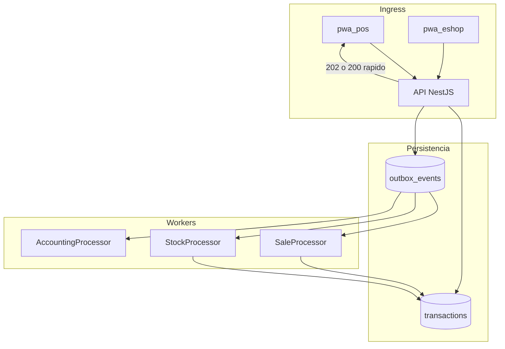

# IF-03 · Mensajería y colas — ventas, stock y eShop

| Campo | Valor |
|-------|-------|
| **ID** | IF-03 |
| **Estado** | Diseño |
| **Prioridad** | P1 (F1) / Pospuesto (F3 Kafka) |
| **Última revisión** | junio 2026 |
| **Tareas** | [ROADMAP.md § IF-03](./ROADMAP.md#if-03--mensajeria-eventos) |

---

## 1. Resumen ejecutivo

Con **varios POS**, **eShop** y latencia de red, el backend actual procesa side-effects de ventas de forma **largamente síncrona**: al crear una transacción se publica `TransactionCreatedEvent` y motores de contabilidad y automatizaciones ejecutan en la misma petición HTTP.

Esta implementación futura introduce **colas de mensajes en el servidor** para desacoplar:

- Aceptación rápida de comandos (venta, movimiento stock, pedido eShop).
- Procesamiento asíncrono de stock, contabilidad y derivadas.

| Fase | Tecnología | Prioridad |
|------|------------|-----------|
| **F1 — MVP** | Transactional Outbox (PostgreSQL) + workers (BullMQ/Redis o polling) | **Primordial** |
| **F2 — Hardening** | DLQ, métricas, particionado | P1 |
| **F3 — Escala** | Kafka / NATS | **No primordial — Pospuesto** |

**No se implementa Kafka en la primera entrega.** Queda documentado como evolución cuando el volumen o la topología multi-sucursal lo justifiquen.

---

## 2. Problema que resuelve

1. **Concurrencia en stock:** varios POS + eShop descontando la misma variante → contención en PostgreSQL y timeouts.
2. **Picos al reconectar:** [IF-02](./IF-02-pos-offline-first.md) puede enviar muchos comandos a la vez; sin cola, la API se satura.
3. **Latencia percibida:** el cajero espera contabilidad + automatizaciones antes del OK de venta.
4. **Acoplamiento:** fallo en un side-effect no debería revertir necesariamente la venta registrada (según política).

Referencia flujo actual: `backend/docs/SALE_TRANSACTION_FLOW.md`

---

## 3. Contexto actual

```
POST /cash-sessions/sales
        │
        ▼
  Create SALE (transacción DB)
        │
        ▼
  TransactionCreatedEvent (síncrono)
        ├── AccountingEngine → asientos
        └── AutomationEngine → UPDATE_STOCK, cuotas, derivadas
        │
        ▼
  Response HTTP (cuando todo terminó)
```

**Cuello de botella:** todo en el hilo de la petición HTTP.

---

## 4. Arquitectura objetivo (F1)



### 4.1 Transactional Outbox

En la misma transacción DB que persiste la venta (o comando):

1. Insert fila en `outbox_events` (`eventType`, `payload`, `partitionKey`, `status=PENDING`).
2. Commit.
3. Worker poll o LISTEN/NOTIFY → procesa → `status=DONE` o `FAILED`.

**Garantía:** at-least-once; consumidores **idempotentes**.

### 4.2 Colas lógicas (v1)

| Cola / topic lógico | Eventos | Consumidor |
|---------------------|---------|------------|
| `sales.commands` | Comandos entrantes (sync POS IF-02) | Validación + persistencia |
| `sales.events` | `SaleConfirmed` | Analytics, notificaciones |
| `inventory.commands` | `StockMovementRequested` | Descuento / reserva stock |
| `eshop.orders` | Pedido checkout eShop | Reserva + venta |

**Partition key stock:** `companyId + productVariantId + storageId` — serializa movimientos por SKU/bodega.

---

## 5. Contrato con IF-02 (POS offline)

1. POS envía comando con `clientOperationId`.
2. API valida, persiste transacción mínima + outbox, responde **200** (sync inmediato) o **202** (procesamiento async).
3. Cliente marca `SYNCED` cuando tiene `transactionId` + folio oficial; side-effects pueden completar después.
4. UI opcional: “Venta registrada; stock en actualización”.

---

## 6. eShop (primera entrega ventas + stock)

Alcance acordado para v1 de mensajería:

- Checkout crea comando en `eshop.orders`.
- Worker: reservar stock → confirmar venta → encolar contabilidad.
- Evita que pico de pedidos online bloquee POS en la misma DB.

Fuera de alcance v1: compras, nómina, CxP async, notificaciones email.

---

## 7. F3 — Kafka / NATS (no primordial)

### 7.1 Cuándo considerar migración

- Más de N sucursales con POS simultáneo (umbral a definir, ej. 20+).
- Múltiples consumidores independientes (BI, integraciones, SII).
- Necesidad de replay de eventos o retención larga.
- Equipo con operación de cluster Kafka gestionado.

### 7.2 Qué no hacer prematuramente

- Introducir Kafka solo por “best practice” sin presión de escala.
- Duplicar outbox **y** Kafka en F1 (elegir outbox primero).

### 7.3 Migración conceptual

Outbox → publicador bridge → Kafka topics; workers existentes como consumers. Estado roadmap: **Pospuesto**.

---

## 8. Observabilidad

| Elemento | Descripción |
|----------|-------------|
| DLQ | Eventos `FAILED` tras N reintentos |
| Métricas | Lag outbox, tiempo procesamiento, tasa error por cola |
| Trazas | `correlationId` = `clientOperationId` o `transactionId` |
| Alertas | Lag > umbral, DLQ no vacía |

---

## 9. Fases de entrega

| Fase | Entregable |
|------|------------|
| **F0** | Diseño (este documento) + esquema `outbox_events` |
| **F1** | Outbox + worker stock + worker contabilidad para `SALE` |
| **F2** | eShop orders + DLQ + métricas |
| **F3** | Evaluación Kafka; POC si métricas lo exigen |

---

## 10. Criterios de aceptación (F1)

1. Venta POS retorna en &lt; 500 ms p95 con contabilidad async.
2. Dos POS vendiendo mismo SKU no producen stock negativo sin conflicto explícito.
3. Evento outbox reprocesado no duplica movimiento stock (idempotencia).
4. Tras caída de worker, eventos pendientes se procesan al reiniciar.
5. Sin regresión en integridad contable (asientos eventualmente consistentes).

---

## 11. Riesgos y mitigaciones

| Riesgo | Impacto | Mitigación |
|--------|---------|------------|
| Consistencia eventual mal explicada al usuario | Medio | UX “procesando”; estados claros |
| Outbox sin worker | Alto | Health check + alerta lag |
| Idempotencia incompleta | Alto | Tests + clave única por evento |
| Complejidad operativa Redis | Medio | Polling PG como fallback MVP |
| Kafka prematuro | Alto | F3 explícitamente pospuesto |

---

## 12. Decisiones abiertas

| # | Pregunta | Opciones | Due |
|---|----------|----------|-----|
| D1 | Transporte F1 | BullMQ+Redis / PG polling | Infra |
| D2 | ¿202 async o 200 con outbox sync? | Híbrido por endpoint | API |
| D3 | Umbral para F3 Kafka | Métricas 6 meses post-F1 | Arquitectura |
| D4 | ¿NestJS microservicio workers o mismo proceso? | Mismo proceso MVP | Backend |

---

## 13. Referencias

- `backend/docs/SALE_TRANSACTION_FLOW.md`
- `backend/src/shared/application/AccountingEngine.ts`
- [IF-02](./IF-02-pos-offline-first.md)
- [ARQUITECTURA §6](../project/ARQUITECTURA_Y_ECOSISTEMA.md)

[← Índice](./README.md) · [Roadmap IF-03](./ROADMAP.md#if-03--mensajeria-eventos)
