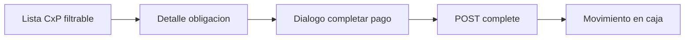

# IF-04 · Cuentas por pagar en POS — pagos desde caja

| Campo | Valor |
|-------|-------|
| **ID** | IF-04 |
| **Estado** | Diseño |
| **Prioridad** | P2 |
| **Última revisión** | junio 2026 |
| **Tareas** | [ROADMAP.md § IF-04](./ROADMAP.md#if-04--cuentas-por-pagar-pos) |

---

## 1. Resumen ejecutivo

**Cuentas por pagar (CxP)** en KaiStore agrupa obligaciones de pago en estado `DRAFT`: facturas proveedor (`SUPPLIER_PAYMENT`), liquidaciones (`PAYROLL_PAYMENT`) y gastos operativos (`EXPENSE_PAYMENT`). Hoy el flujo completo existe en **pwa-admin** (`/accounting/accounts-payable`); **no existe en POS**.

Esta implementación futura permite al encargado de tienda **pagar obligaciones desde la caja** (efectivo, transferencia, cheque — **paridad con admin**), vinculando el pago a la sesión de caja abierta.

| Capa | Estado |
|------|--------|
| Backend API | Listo |
| Admin UI | Listo |
| POS UI | **Por implementar** |
| Offline | Depende [IF-02](./IF-02-pos-offline-first.md) |

---

## 2. Problema que resuelve

Escenarios frecuentes en retail:

- Pago en efectivo a proveedor al momento de entrega (factura ya registrada en admin).
- Pago de honorarios o gastos menores desde caja del local.
- Pago de nómina en efectivo desde sucursal (con rol autorizado).

Sin CxP en POS, el cajero debe usar admin (otro dispositivo) o registrar movimientos manuales sin trazabilidad al plan de pago.

---

## 3. Backend existente

### 3.1 Endpoints

| Método | Ruta | Uso |
|--------|------|-----|
| `GET` | `/accounts-payable` | Listar obligaciones (filtros: tipo, fechas, vencidas, búsqueda) |
| `GET` | `/accounts-payable/:id/payment-context` | Detalle para completar pago |
| `POST` | `/accounts-payable/:id/complete` | Ejecutar pago (`CompletePaymentDto`) |

Controlador: `backend/src/modules/transactions/presentation/accounts-payable.controller.ts`

Alias legacy: `GET /installments/accounts-payable` (mismo servicio).

### 3.2 Servicio

`AccountsPayableService` — lista filas `AccountsPayableRowDto` con `paymentType`, beneficiario, montos, fechas, estado.

Completar pago vía `CompletePaymentCommand` → `complete-payment.usecase.ts` → `PAYMENT_EXECUTION` + actualización padre.

### 3.3 Medios de pago (alcance confirmado)

**Igual que admin:** efectivo, transferencia y cheque según contexto del pago y datos en `CompletePaymentDto` / `payment-context`.

Referencia UI: `pwa-admin/app/(app)/accounting/accounts-payable/ui/CompleteAccountsPayablePaymentDialog.tsx`

---

## 4. Referencia admin (reutilizar patrones)

| Pieza | Ubicación |
|-------|-----------|
| Feature layer | `pwa-admin/src/features/accounting-accounts-payable/` |
| Listado + filtros | `AccountsPayablePageContent.tsx`, `AccountsPayableDataGrid.tsx` |
| Calendario vencimientos | `AccountsPayableCalendar.tsx` |
| Completar pago | `CompleteAccountsPayablePaymentDialog.tsx` |
| Labels / tipos | `accounts-payable-labels.ts` |

**No copiar ciego:** POS debe integrar sesión de caja, layout topbar y permisos de rol cajero.

---

## 5. Brechas en `pwa-pos`

| Brecha | Detalle |
|--------|---------|
| Ruta / página | No existe `/accounts-payable` ni equivalente |
| Navegación | `PosTopBar` sin ícono CxP |
| Feature module | Sin `features/accounting-accounts-payable` en POS |
| Server actions | Sin `accounts-payable.request.ts` / actions |
| Cobro UX | Reutilizar ideas de `PosPaymentWorkspace` (medios, arqueo) |
| Permisos | Definir: ¿CASHIER solo lectura? ¿MANAGER paga? |
| Trazabilidad caja | Pasar `cashSessionId` / `pointOfSaleId` en `complete` si API lo admite |
| Offline | Comando idempotente; riesgo **doble pago** si sync duplicado |

---

## 6. Propuesta UX POS

### 6.1 Flujo principal

1. **Lista:** obligaciones `DRAFT` / vencidas; filtros por tipo (proveedor, nómina, gasto) y búsqueda.
2. **Detalle:** documento origen, beneficiario, monto, vencimiento, cuotas si aplica.
3. **Pagar:** diálogo paridad admin — medio de pago, cuenta bancaria si transferencia, datos cheque.
4. **Confirmación:** recibo / comprobante; refresco lista; movimiento en `/cash/movements`.

### 6.2 Navegación

- Ícono en `PosTopBar` (ej. `Receipt` o `Wallet`) → `/accounts-payable`.
- Visible solo para roles autorizados (`MANAGER`, `ADMIN`).

### 6.3 Integración caja

- Requiere sesión abierta (mismo guard que venta).
- Efectivo: impacta arqueo de cierre.
- Transferencia / cheque: sin efectivo en caja pero trazable en tesorería.

---

## 7. Offline (IF-02)

| Riesgo | Mitigación |
|--------|------------|
| Doble pago al sync | `clientOperationId` + idempotencia en `complete` |
| Obligación ya pagada en admin | Servidor rechaza; UI muestra `CONFLICT` |
| Pago offline largo | Advertir si obligación cambió al reconectar |

Fase **F2** de IF-04: después de F1 online estable.

---

## 8. Fases de entrega

| Fase | Entregable |
|------|------------|
| **F0** | Diseño (este documento) |
| **F1** | Lista + detalle + completar pago online; permisos; movimiento caja |
| **F2** | Soporte offline vía cola IF-02 |
| **F3** | Calendario vencimientos en POS (opcional, P3) |

---

## 9. Criterios de aceptación (F1)

1. Listar obligaciones pendientes desde POS con filtros básicos.
2. Completar pago en efectivo de factura proveedor; estado pasa a completado en admin.
3. Transferencia y cheque funcionan con mismos campos que admin.
4. Usuario sin permiso no ve acción de pago.
5. Movimiento reflejado en sesión de caja abierta.

---

## 10. Decisiones abiertas

| # | Pregunta | Opciones | Due |
|---|----------|----------|-----|
| D1 | Roles con permiso de pago | MANAGER+ / ADMIN only | Producto |
| D2 | ¿Extender `CompletePaymentDto` con `cashSessionId`? | Sí / usar metadata | Backend |
| D3 | ¿Calendario en POS F1 o F3? | F3 (recomendado) | UX |
| D4 | ¿Notificación si otra caja pagó la misma obligación? | Push / solo al refresh | IF-03 |

---

## 11. Referencias

- `backend/src/modules/transactions/application/services/accounts-payable.service.ts`
- `pwa-admin/src/features/accounting-accounts-payable/`
- `pwa-pos/src/shared/components/PosTopBar/PosTopBar.tsx`
- [ARQUITECTURA §6.2 — Compra / CxP](../project/ARQUITECTURA_Y_ECOSISTEMA.md)
- [IF-02](./IF-02-pos-offline-first.md)

[← Índice](./README.md) · [Roadmap IF-04](./ROADMAP.md#if-04--cuentas-por-pagar-pos)
