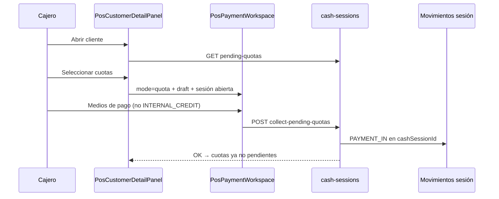

# IF-05 · Crédito de clientes en POS — flujos y brechas UI

| Campo | Valor |
|-------|-------|
| **ID** | IF-05 |
| **Estado** | Diseño |
| **Prioridad** | P1 |
| **Última revisión** | junio 2026 |
| **Tareas** | [ROADMAP.md § IF-05](./ROADMAP.md#if-05--credito-clientes-pos) |

---

## 1. Resumen ejecutivo

KaiStore soporta **crédito interno** (fiado con la tienda): línea de crédito del cliente, ventas a plazo, cuotas (`installments`) y cobranza. El **backend tiene la base**, pero en POS faltan piezas críticas — sobre todo **cobro de cuotas desde la ficha del cliente con movimiento de sesión de caja** — y la **simetría con Cuentas por pagar** (plan de cobro en venta → materialización de cuotas).

| Flujo | Backend | UI POS |
|-------|---------|--------|
| Ver límite / utilizado / disponible | Listo | Listo |
| Venta sin cobro (`deferPayment`) | Listo | Listo |
| Cobro saldo venta (AR simple) | Listo | Listo (`PurchasesSection` → `mode=collect`) |
| Listar cuotas pendientes (CxC calendario) | Listo | Solo lectura |
| **Cobrar cuota(s) desde ficha** | Parcial (sin `cashSessionId`) | **No implementado** |
| Venta con `INTERNAL_CREDIT` | Listo | Casi listo (validación UI) |
| **Plan de cobro en venta** (cuotas calendario) | Solo vía automatización/metadata | **No** (sin `PlannedPaymentPlanSection`) |

**Objetivo IF-05:** cobranza POS **online** alineada a caja (F1), pulido de crédito interno en venta (F2), offline (F3). Opcional F4: plan de cobro en venta (espejo CxP).

---

## 2. Conceptos de negocio (decisiones de producto)

### 2.1 Alcance del crédito interno

| Concepto | Medio / dato | Tratamiento en POS |
|----------|--------------|-------------------|
| Fiado / línea de crédito | `INTERNAL_CREDIT` + `creditLimit` | Consume **disponible**; validar límite al vender |
| Calendario de cobro | Cuotas `installments` | Cada cuota = **cuenta por cobrar** (CxC) |
| Venta sin cobro inmediato | `deferPayment` | Saldo en Compras; cuotas si hay plan o automatización |

### 2.2 Espejo Cuentas por pagar ↔ Cuentas por cobrar

La lógica es la **misma que CxP pero invertida** (ver [IF-04](./IF-04-pos-cuentas-por-pagar.md) y `PlannedPaymentPlanSection` en compras):

| CxP (pagamos) | CxC (cobramos) |
|---------------|----------------|
| Padre: `SUPPLIER_INVOICE` / recepción | Padre: `SALE` |
| Modo **pendiente** sin cuotas → sin filas en CxP | Sin plan de cobro → sin cuotas en calendario (puede quedar saldo o línea) |
| Modo **pendiente con cuotas** → hijos `SUPPLIER_PAYMENT` DRAFT | **Plan de cobro pactado** → hijos `installments` (CxC) |
| Cobro en admin / tesorería | Cobro en POS desde **ficha cliente** |

**Regla:** crédito interno **pactado en cuotas** genera **cuentas por cobrar** (cada cuota pendiente es un cobro futuro). No basta con marcar `INTERNAL_CREDIT` en el cobro de la venta si se quiere **calendario**; hace falta **plan de cuotas** en la venta (hoy: metadata `numberOfInstallments` + `firstDueDate` vía automatización; objetivo F4: mismo UI que compras).

### 2.3 Tres caras técnicas de la deuda del cliente (hoy)

| Mecanismo | Qué es | Dónde se ve en POS | Cómo se cobra |
|-----------|--------|-------------------|---------------|
| **Cuotas** (`installments`) | CxC con vencimiento | Ficha → **Cuotas pendientes** | `pay-quota` / futuro `collect-pending-quotas` |
| **Saldo venta** (`balanceDue`, `deferPayment`) | CxC sin calendario explícito | Ficha → **Compras** | `mode=collect` ✅ |
| **Línea de crédito** (`currentBalance` / `usedCredit`) | Cupo consumido | Ficha → **Crédito** | Se mueve al **vender** con `INTERNAL_CREDIT`; no es cobro de cuota |

---

## 3. Problema que resuelve

En mostrador, el cajero debe poder:

1. Vender a fiado (sin cobro inmediato, con `INTERNAL_CREDIT`, o con plan de cuotas cuando exista F4).
2. **Cobrar cuotas desde la ficha del cliente** (sección Cuotas pendientes), con medios de pago del POS (sin `INTERNAL_CREDIT`).
3. Registrar ese cobro como **movimiento de la sesión de caja abierta** (paridad con cobro AR en Compras).
4. Ver límite / utilizado / disponible sin ir al admin.

Hoy: cuotas se listan pero no se cobran; `/pos/credit-payment` es placeholder y **no** es el flujo principal.

---

## 4. Flujos de negocio

### 4.1 Venta a crédito sin cobro (`deferPayment`)

- **UI:** `PosPaymentWorkspace` → `deferPayment: true`.
- **Backend:** `POST /cash-sessions/sales` → `SALE` con `paymentStatus` pendiente.
- **CxC:** saldo en Compras (`balanceDue`); cuotas solo si automatización creó `installments`.
- **Estado:** operativo online.

### 4.2 Cobro de saldo de venta (AR simple)

- **UI:** ficha → **Compras** → selección → “Cobrar selección” → `/pos/payment?mode=collect`.
- **Backend:** `POST /cash-sessions/collect-pending-sales` (incluye `cashSessionId`, `pointOfSaleId`).
- **Restricción:** no `INTERNAL_CREDIT` ni abono de encargo.
- **Caja:** movimiento en sesión ✅
- **Estado:** operativo online.

### 4.3 Cobro de cuotas (`installments`) — brecha principal

- **UI (decisión producto):** **solo** ficha cliente → sección **Cuotas pendientes**:
  1. Checkboxes + total (patrón `PurchasesSection`).
  2. “Cobrar cuotas” → `writePosQuotaCollectDraft` → `/pos/payment?mode=quota`.
  3. Requiere **sesión de caja abierta**.
- **Backend hoy:** `GET /customers/:id/pending-quotas` + `POST /payments/pay-quota`.
- **Backend objetivo:** cobro con **`cashSessionId`** (recomendado: `POST /cash-sessions/collect-pending-quotas`, espejo de `collect-pending-sales`).
- **Medios:** catálogo POS estándar — **no** `INTERNAL_CREDIT` (no crear deuda al cobrar deuda).
- **Caja:** movimiento en sesión — **obligatorio** en F1 (no opcional).
- **Estado UI:** **no implementado**.

### 4.4 Crédito interno como medio en la venta (`INTERNAL_CREDIT`)

- **Backend:** validación de límite en `sales-from-session.service`; sube `customer.currentBalance`.
- **UI POS:** contexto empresa + disponible en `PosPaymentWorkspace`; validación monto ≤ disponible.
- **Estado:** operativo con pulido menor (F2).
- **No sustituye** plan de cuotas ni cobro posterior en Cuotas.

---

## 5. Mapa de servicios backend

| Capacidad | Endpoint / servicio | Notas |
|-----------|---------------------|-------|
| Política crédito interno | `GET/PATCH` internal-customer-credit | `companies.controller.ts` |
| Límite / utilizado / disponible | `findOne` + repo | `typeorm-customers.repository.ts` |
| Cuotas pendientes (CxC) | `GET /customers/:id/pending-quotas` | → `installmentService.getAccountsReceivable` |
| Pago cuota (legacy) | `POST /payments/pay-quota` | Ver §5.2 — **no ata caja** |
| Cobro AR ventas | `POST /cash-sessions/collect-pending-sales` | **Modelo a replicar** para cuotas |
| Cobro cuotas (propuesto) | `POST /cash-sessions/collect-pending-quotas` | F1 — `cashSessionId`, medios, allocations |
| Venta deferida | `POST /cash-sessions/sales` + `deferPayment` | |
| CxC admin | `GET /accounts-receivable` | `installments` module |
| Materializar cuotas en venta | Automatización `numberOfInstallments` | F4: plan explícito en POS |

### 5.1 Contrato `PayQuotaDto` (actual)

```typescript
// backend/src/modules/payments/application/dto/pay-quota.dto.ts
{
  saleTransactionId: string;
  paidQuotaId: string;      // installment id
  amount: number;
  paymentMethod: string;
  bankAccountId?: string;
}
```

**Gaps conocidos:**

1. Sin `cashSessionId` / `pointOfSaleId` → no aparece en movimientos de caja.
2. `PaymentsService.payQuota` delega a `PaymentsServiceAdapter` con contrato distinto (`paymentId`) — el camino legacy (`installmentService.payInstallment`) puede no ejecutarse; **corregir antes o junto con F1**.

### 5.2 Contrato objetivo cobro cuotas desde POS (propuesta)

Espejo de `CollectPendingSalesDto`:

```typescript
{
  userName: string;
  pointOfSaleId: string;
  cashSessionId: string;
  customerId: string;
  installmentIds: string[];   // paidQuotaId[]
  payments: PaymentDetailDto[];
}
```

Un `PAYMENT_IN` (o batch con `metadata.allocations`) por sesión, cuota(s) marcadas pagadas vía `installmentService.updateInstallmentFromPayment`.

---

## 6. Brechas UI en `pwa-pos`

| Capacidad | Componente | Estado |
|-----------|------------|--------|
| Ver crédito (límite, utilizado, disponible) | `CreditSection` | OK |
| Listar cuotas | `QuotasSection` | Solo lectura |
| **Cobrar cuotas desde ficha** | `QuotasSection` + `mode=quota` | **Falta** |
| Cobrar ventas pendientes | `PurchasesSection` → `mode=collect` | OK |
| Venta sin cobro | `handleDeferPaymentSale` | OK |
| `INTERNAL_CREDIT` en venta | `PosPaymentWorkspace` | Casi OK (F2 pulido) |
| Movimiento sesión al cobrar cuota | — | **Falta** (backend + POS) |
| Plan de cobro en venta | — | **F4** (espejo `PlannedPaymentPlanSection`) |
| Hub `/pos/credit-payment` | placeholder | P3 / descartable |

### 6.1 Patrón a replicar (`PurchasesSection` → cuotas)

```text
PurchasesSection (hoy)              QuotasSection (objetivo)
──────────────────────              ──────────────────────
filas con balanceDue > 0            filas pending-quotas
checkbox + total                    checkbox + total
writePosArCollectDraft              writePosQuotaCollectDraft
/pos/payment?mode=collect           /pos/payment?mode=quota
collect-pending-sales + cashSession collect-pending-quotas + cashSession
```

---

## 7. Propuesta UX (wireflow)



### 7.1 Pantalla de cobro (`mode=quota`)

- Título: “Cobro de cuotas”.
- Líneas: folio venta, vencimiento, monto cuota.
- Medios: catálogo POS estándar.
- **No** `INTERNAL_CREDIT`.
- Recibo / comprobante; refresco ficha.

### 7.2 Navegación (cerrado)

- **Canal principal:** ficha cliente → Cuotas pendientes (**obligatorio**).
- `/pos/credit-payment`: no prioritario (P3).

---

## 8. `INTERNAL_CREDIT` — F2 (pulido, no rediseño)

1. Medio visible solo si `internalCustomerCredit.enabled` y cliente con `availableCredit > 0`.
2. Validar monto ≤ disponible en UI (ya parcialmente en `PosPaymentWorkspace`).
3. Mostrar disponible restante en panel de cobro.

---

## 9. Plan de cobro en venta — F4 (espejo CxP, posterior)

Reutilizar `PlannedPaymentPlanSection` / `buildPlannedPaymentPayload` con beneficiario **cliente**:

| Modo (espejo CxP) | Venta | Genera |
|-------------------|-------|--------|
| `PENDING` | Fiado sin calendario | Sin `installments`; opcional saldo / línea |
| `PENDING_SCHEDULED` | Crédito pactado en cuotas | N × `installments` → CxC |
| `PARTIAL` | Abono hoy + cuotas saldo | Cuotas por saldo |
| `COMPLETED` | Cobro total en el acto | Sin CxC |

Backend: servicio espejo de `SupplierDocumentPaymentPlanService` → `createInstallmentsForTransaction` / `createSingleInstallment`.

---

## 10. Offline (IF-02) — F3

| Aspecto | Enfoque |
|---------|---------|
| Límite de crédito | Snapshot al abrir sesión |
| Venta a crédito offline | Snapshot + reconciliación |
| Cobro cuota offline | Cola con `cashSessionId`; validar cuota no pagada al sync |
| Conflicto | `CONFLICT` si límite o cuota ya pagada |

---

## 11. Fases de entrega

| Fase | Entregable |
|------|------------|
| **F1** | `QuotasSection` selección + `mode=quota` + API con `cashSessionId` + movimiento caja + recibo; fix `pay-quota` / adapter |
| **F2** | Pulido `INTERNAL_CREDIT` en venta; docs operación cajero |
| **F3** | Offline (IF-02) |
| **F4** | Plan de cobro en venta POS (espejo CxP) + materialización `installments` |

---

## 12. Criterios de aceptación (F1)

1. Desde **ficha cliente → Cuotas pendientes**, seleccionar una o más cuotas y cobrar con efectivo.
2. Cuota desaparece de pendientes tras cobro exitoso.
3. Cobro registrado en **movimientos de la sesión de caja abierta** (mismo criterio que `mode=collect`).
4. Efectivo impacta arqueo al cierre; transferencia/cheque trazables sin efectivo en caja.
5. Sin `INTERNAL_CREDIT` en cobro de cuotas.
6. Sin regresión en `mode=collect` (Compras).
7. Idempotencia en reintento (definir `clientOperationId` o clave de job).

---

## 13. Decisiones (estado)

| # | Pregunta | Decisión |
|---|----------|----------|
| D1 | ¿Cobro cuota con `cashSessionId`? | **Sí, obligatorio** — endpoint espejo `collect-pending-quotas` (recomendado) |
| D2 | ¿Un POST por cuota o batch? | Batch por operación de caja (como AR); aplicar N cuotas en una transacción lógica |
| D3 | ¿Dónde cobrar cuotas? | **Solo ficha → Cuotas pendientes** |
| D4 | ¿Pago parcial de cuota? | No MVP |
| D5 | ¿Cuotas sin plan en venta? | Sin plan programado no hay filas en calendario CxC (igual que CxP sin cuotas) |

---

## 14. Referencias

- `pwa-pos/src/features/customers/ui/PosCustomerDetailPanel.tsx` — `QuotasSection`, `PurchasesSection`
- `pwa-pos/src/features/session/lib/pos-ar-collect-storage.ts` — patrón draft AR
- `pwa-pos/src/app/(pos)/pos/payment/ui/PosPaymentWorkspace.tsx`
- `backend/src/modules/cash-sessions/application/sales-from-session.service.ts` — `collectPendingSales`
- `backend/src/modules/installments/application/services/installment.service.ts` — `getAccountsReceivable`, `payInstallment`
- `backend/src/modules/payments/presentation/payments.controller.ts`
- `pwa-admin/src/shared/components/PlannedPaymentLines/` — plan de pago compras (espejo F4)
- [IF-02](./IF-02-pos-offline-first.md) · [IF-04](./IF-04-pos-cuentas-por-pagar.md) · [INC-08](../project/inconsistencias/INC-08-cuentas-por-cobrar-legacy-vs-codigo.md)

[← Índice](./README.md) · [Roadmap IF-05](./ROADMAP.md#if-05--credito-clientes-pos)
