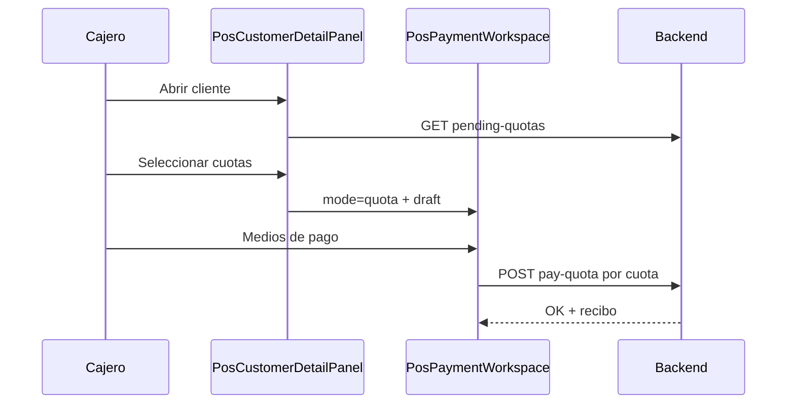

# IF-05 · Crédito de clientes en POS — flujos y brechas UI

| Campo | Valor |
|-------|-------|
| **ID** | IF-05 |
| **Estado** | Diseño |
| **Prioridad** | P1 |
| **Última revisión** | junio 2026 |
| **Tareas** | [ROADMAP.md § IF-05](./ROADMAP.md#if-05--credito-clientes-pos) |

---

## 1. Resumen ejecutivo

KaiStore soporta **crédito interno** para clientes (límite, utilizado, disponible), ventas a plazo, cuotas (`installments`) y cobranza de saldos pendientes. El **backend está mayormente implementado**; en `pwa-pos` faltan piezas de UI críticas — en particular el **cobro de cuotas** — y la integración unificada del medio de pago `INTERNAL_CREDIT`.

| Flujo | Backend | UI POS |
|-------|---------|--------|
| Ver límite / disponible | Listo | Listo |
| Venta sin cobro (`deferPayment`) | Listo | Listo |
| Cobro saldo venta (AR) | Listo | Listo |
| Listar cuotas pendientes | Listo | Solo lectura |
| **Pagar cuota** | Listo | **No implementado** |
| Venta con `INTERNAL_CREDIT` | Listo | Parcial |

**Objetivo IF-05:** cerrar brechas de producto en POS para crédito y cobranza **online** (F1–F2), preparando extensión offline en [IF-02](./IF-02-pos-offline-first.md) (F3).

---

## 2. Problema que resuelve

En mostrador, el cajero debe poder:

1. Vender a crédito (sin cobro inmediato o con medio `INTERNAL_CREDIT`).
2. Cobrar después saldos de ventas o cuotas planificadas.
3. Ver en ficha cliente el estado de crédito sin ir al admin.

Hoy el cobro de cuotas está documentado solo como placeholder en `/pos/credit-payment`; las cuotas se listan pero no tienen acción de cobro.

---

## 3. Flujos de negocio

### 3.1 Venta a crédito sin cobro (`deferPayment`)

- **UI:** botón en `PosPaymentWorkspace` → `createSaleFromPosAction` con `deferPayment: true`.
- **Backend:** `POST /cash-sessions/sales` crea `SALE` con `paymentStatus` pendiente y cuotas si aplica automatización.
- **Estado:** operativo online.

### 3.2 Cobro de saldo de venta (cuentas por cobrar / AR)

- **UI:** ficha cliente → sección Compras → seleccionar ventas con `balanceDue > 0` → “Cobrar selección” → `/pos/payment?mode=collect`.
- **Backend:** `POST /cash-sessions/collect-pending-sales`.
- **Restricción backend:** no admite `INTERNAL_CREDIT` ni abono de encargo en cobro AR.
- **Estado:** operativo online.

### 3.3 Cobro de cuotas (`installments`)

- **UI esperada:** ficha cliente → Cuotas pendientes → seleccionar → cobrar (medios de pago estándar).
- **Backend:** `GET /customers/:id/pending-quotas` + `POST /payments/pay-quota` (`PayQuotaDto`).
- **Estado UI:** **brecha principal** — `QuotasSection` es solo tabla; `/pos/credit-payment` es placeholder.

### 3.4 Crédito interno como medio de pago (`INTERNAL_CREDIT`)

- **Backend:** `sales-from-session.service` valida límite disponible al incluir `INTERNAL_CREDIT` en pagos de venta.
- **Empresa:** flag `settings.internalCustomerCredit.enabled` vía companies API.
- **UI POS:** label en `payment-method-label.ts`; catálogo efectivo depende de `getEffectivePosPaymentMethods`; flujo no documentado ni unificado en UX.
- **Estado:** parcial.

---

## 4. Mapa de servicios backend

| Capacidad | Endpoint / servicio | Ubicación |
|-----------|---------------------|-----------|
| Política crédito interno | `GET/PATCH` internal-customer-credit | `companies.controller.ts` |
| Límite / utilizado / disponible | `findOne` + repo | `typeorm-customers.repository.ts` |
| Cuotas pendientes | `GET /customers/:id/pending-quotas` | `customers.controller.ts` → `installmentService.getAccountsReceivable` |
| Pago cuota | `POST /payments/pay-quota` | `payments.controller.ts` |
| Cobro AR múltiple | `POST /cash-sessions/collect-pending-sales` | `sales-from-session.service.ts` |
| Venta deferida | `POST /cash-sessions/sales` + `deferPayment` | `sales-from-session.service.ts` |
| Fuentes de pago cliente (NC, anticipos) | `GET /customers/:id/pos-payment-sources` | `customerPaymentSourcesService` |

### 4.1 Contrato `PayQuotaDto` (actual)

```typescript
// backend/src/modules/payments/application/dto/pay-quota.dto.ts
{
  saleTransactionId: string;
  paidQuotaId: string;      // installment id
  amount: number;
  paymentMethod: string;
  bankAccountId?: string;
}
```

**Gap:** no incluye `cashSessionId` ni `pointOfSaleId` — ver decisión abierta D1.

---

## 5. Brechas UI en `pwa-pos`

| Capacidad | Componente / ruta | Estado |
|-----------|-------------------|--------|
| Ver crédito (límite, utilizado, disponible) | `CreditSection` en `PosCustomerDetailPanel` | OK |
| Listar cuotas | `QuotasSection` | Solo lectura |
| Pagar cuota | `credit-payment/page.tsx` | Placeholder |
| Acción “Cobrar cuotas” en ficha | — | Falta |
| Cobrar ventas pendientes | `PurchasesSection` → `mode=collect` | OK |
| Venta sin cobro | `handleDeferPaymentSale` | OK |
| Crear cliente con límite | `PosCreateCustomerDialog` (si crédito habilitado) | OK |
| `INTERNAL_CREDIT` en cobro venta | `PosPaymentWorkspace` + métodos efectivos | Parcial |
| Trazabilidad caja en pago cuota | — | Por definir |
| Offline crédito | — | Depende IF-02 |

### 5.1 Evidencia placeholder

`pwa-pos/src/app/(pos)/pos/credit-payment/page.tsx` indica explícitamente que falta implementar cobro con `pending-quotas` + `pay-quota`.

### 5.2 Contraste con AR (patrón a replicar)

`PurchasesSection` ya implementa el patrón deseado para cuotas:

1. Filtrar filas cobrables.
2. Selección múltiple + total.
3. `writePosArCollectDraft` + `router.push("/pos/payment?mode=collect")`.

Para cuotas: equivalente `writePosQuotaCollectDraft` + `mode=quota`.

---

## 6. Propuesta UX (wireflow)



### 6.1 Pantalla de cobro (`mode=quota`)

Reutilizar `PosPaymentWorkspace` con variante similar a `mode=collect`:

- Título: “Cobro de cuotas”.
- Líneas: documento venta, vencimiento, monto cuota.
- Medios de pago: CASH, tarjetas, transferencia, cheque (según catálogo POS).
- **No** `INTERNAL_CREDIT` en cobro de cuota (coherente con cobro AR).
- Recibo / comprobante al confirmar.

### 6.2 Navegación

- Opción A: acción en `QuotasSection` (recomendado, paridad con Compras).
- Opción B: completar `/pos/credit-payment` como hub de búsqueda cliente → cuotas.
- Topbar: enlace opcional a credit-payment (P2).

---

## 7. `INTERNAL_CREDIT` — unificación F2

1. Mostrar medio solo si `internalCustomerCredit.enabled` y cliente seleccionado con `availableCredit > 0`.
2. Validar monto ≤ disponible en UI (feedback antes de POST).
3. Mostrar disponible restante en panel de cobro.
4. Alinear con validación servidor en `sales-from-session.service`.

---

## 8. Offline (dependencia IF-02)

| Aspecto | Enfoque |
|---------|---------|
| Límite de crédito | Snapshot al abrir sesión / sync catálogo clientes frecuentes |
| Venta a crédito offline | Permitir con snapshot; reconciliar al sync |
| Cobro cuota offline | Comando en cola; validar cuota no pagada en servidor |
| Conflicto | Si límite excedido al sync → `CONFLICT` + resolución manual |

---

## 9. Fases de entrega

| Fase | Entregable |
|------|------------|
| **F1** | `QuotasSection` con selección + `mode=quota` + `pay-quota` + recibo |
| **F2** | `INTERNAL_CREDIT` unificado en venta; extender API si hace falta `cashSessionId` |
| **F3** | Integración offline (IF-02) |

---

## 10. Criterios de aceptación (F1)

1. Desde ficha cliente, seleccionar una o más cuotas y cobrar con efectivo.
2. Cuota desaparece de pendientes tras cobro exitoso.
3. `POST /payments/pay-quota` idempotente si se reintenta mismo pago (definir clave).
4. Cobro de cuota visible en movimientos de sesión de caja (si D1 se resuelve afirmativo).
5. Sin regresión en flujo `mode=collect` existente.

---

## 11. Decisiones abiertas

| # | Pregunta | Opciones | Due |
|---|----------|----------|-----|
| D1 | ¿`pay-quota` debe recibir `cashSessionId` / `pointOfSaleId`? | Extender DTO / metadata en PAYMENT_IN | Backend + POS |
| D2 | ¿Un POST por cuota o batch? | Uno por cuota (actual) / múltiple | Producto |
| D3 | Hub `/pos/credit-payment` vs solo ficha cliente | Ficha primero (recomendado) | UX |
| D4 | ¿Permitir pago parcial de cuota? | No MVP / sí con saldo | Producto |

---

## 12. Referencias

- `pwa-pos/src/features/customers/ui/PosCustomerDetailPanel.tsx`
- `pwa-pos/src/app/(pos)/pos/payment/ui/PosPaymentWorkspace.tsx`
- `pwa-pos/src/app/(pos)/pos/credit-payment/page.tsx`
- `backend/src/modules/payments/presentation/payments.controller.ts`
- `backend/src/modules/customers/presentation/customers.controller.ts`
- [IF-02](./IF-02-pos-offline-first.md)

[← Índice](./README.md) · [Roadmap IF-05](./ROADMAP.md#if-05--credito-clientes-pos)
