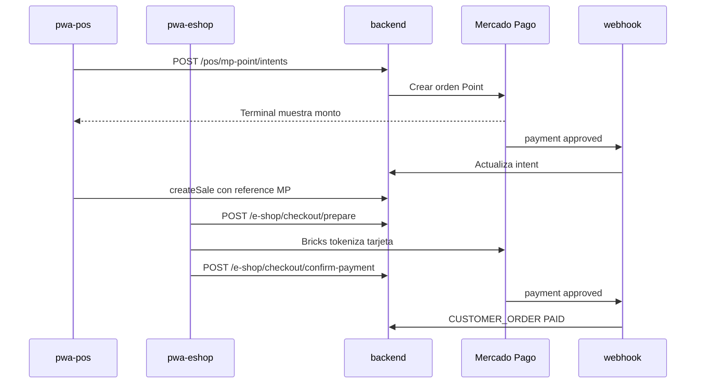

# IF-12 · Mercado Pago — POS Point + eShop Checkout Bricks

| Campo | Valor |
|-------|-------|
| **ID** | IF-12 |
| **Estado** | En curso |
| **Prioridad** | P1 |
| **Última revisión** | junio 2026 |
| **Tareas** | [ROADMAP.md § IF-12](./ROADMAP.md#if-12--mercado-pago--pos-point--eshop-bricks) |
| **Referencias** | [MP Point](./integraciones/mercado-libre/mp-point.md) · [Checkout API](./integraciones/mercado-libre/checkout-api-payments.md) |

---

## 1. Resumen ejecutivo

KaiStore integra **Mercado Pago** como pasarela única para:

1. **POS presencial** — terminal **Point** (API en la nube, sin agente local).
2. **eShop web** — **Checkout Bricks** (pago embebido en el checkout).

| Canal | Antes | Después IF-12 |
|-------|-------|---------------|
| POS | Cajero registra tarjeta a mano | Botón **Cobrar con Point** → línea automática |
| eShop | Solo encargo (`paymentExpectation: NONE`) | **Pagar ahora** (Bricks) o **Coordinar después** |

**Admin UI:**

- **Configuración → Integraciones** — cuenta MP (credenciales) + POS Point.
- **eShop → Integraciones** — comportamiento del checkout online (sin duplicar tokens).

---

## 2. Arquitectura

### Módulo backend

`backend/src/modules/payment-gateways/`:

- Tabla `payment_gateway_intents`
- `MercadoPagoClient` — HTTP/SDK
- Webhook `POST /webhooks/mercado-pago` (`@SkipTenant`)
- Controllers POS (`TenantGuard`) y eShop (`EShopStoreGuard`)

### Settings (`company.settings.mercadoPago`)

| Campo | Uso |
|-------|-----|
| `enabled` | Master switch |
| `environment` | `sandbox` \| `production` |
| `publicKey` | Bricks (eShop) |
| `accessToken` | Solo backend |
| `pointTerminalId` | POS Point |
| `posPointEnabled` | Botón en caja |
| `eshopOnlinePaymentEnabled` | Checkout online |
| `eshopDefaultPaymentMode` | `online` \| `coordinate` |

---

## 3. Modelo `payment_gateway_intents`

| Columna | Descripción |
|---------|-------------|
| `channel` | `POS_POINT` \| `ESHOP_CHECKOUT` |
| `status` | `CREATED`, `PENDING`, `APPROVED`, `REJECTED`, `CANCELLED`, `EXPIRED`, `CONSUMED` |
| `amount` | CLP entero |
| `mp_payment_id` | Unique cuando existe |
| `external_reference` | `ks:{companyId}:{channel}:{uuid}` |
| `cash_session_id` / `transaction_id` | Contexto POS o pedido |

---

## 4. Admin

| Ruta | Contenido |
|------|-----------|
| `/settings/integrations` | Cuenta MP + POS Point |
| `/e-shop/integrations` | Pago online checkout + modo por defecto |

Credenciales **una sola vez** en Configuración; eShop lee estado y flags.

---

## 5. Fases

| Fase | Entregable |
|------|------------|
| F0 | Cuenta MP, terminal, ngrok webhook — ver [credenciales sandbox](./integraciones/mercado-libre/credenciales-sandbox-y-pruebas.md) |
| F1 | Backend intents + settings + webhook |
| F2 | Admin integraciones |
| F3 | POS Point |
| F4 | eShop Bricks |
| F5 | Tests + producción |

Variable entorno: `MP_WEBHOOK_BASE_URL`.

---

## 6. Fuera de alcance v1

- Reembolsos MP desde KaiStore
- Transbank Webpay / Getnet POS
- Agente local USB
- Split marketplace

---

## 7. Criterios de aceptación MVP

- [ ] Sandbox Point: intent `APPROVED` → venta con referencia MP
- [ ] Bricks tarjeta test `APRO` → pedido `PAID`
- [ ] Encargo sin MP sigue funcionando
- [ ] Webhook idempotente
- [ ] Admin guarda settings sin exponer token completo en UI
