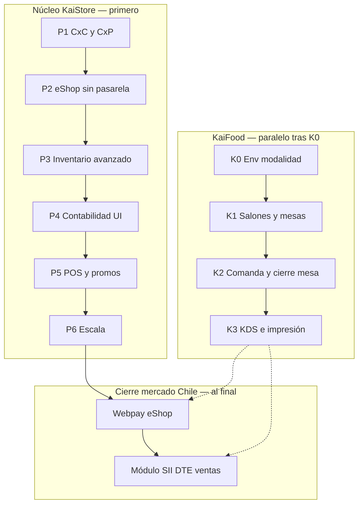

# KaiStore / KaiFood — Roadmap de producto (flow-store-2)

Hoja de ruta interna para priorizar desarrollo en el monorepo **flow-store-2**. El mismo código base sirve dos **modalidades de producto**:

| Modalidad | Enfoque | Apps típicas |
|-----------|---------|--------------|
| **KaiStore** | Retail / ERP — catálogo, compras, POS mostrador, eShop | `pwa-admin`, `pwa-pos`, `pwa-stock`, `pwa-eshop` |
| **KaiFood** | Gastronomía — salones, mesas, comandas, cocina (vs Fudo) | Mismas apps + flujos salón en POS/admin |

La modalidad se define **al cargar cada app** vía variables de entorno (ver § Modalidades). Complementa el análisis competitivo y los backlogs por módulo.

**Última revisión:** mayo 2026  
**Alcance:** `backend`, `pwa-admin`, `pwa-pos`, `pwa-stock`, `pwa-eshop`

---

## Documentos relacionados

| Documento | Contenido |
|-----------|-----------|
| `ANALISIS_COMPETITIVO_BSALE_VS_KAISTORE.md` | Bsale, Fudo vs KaiStore; contexto de mercado |
| `KAISTORE_E-SHOP_PHASE2_BACKLOG.md` | Detalle ítems tienda |
| `KAISTORE_E-SHOP_DEVELOPMENT_GUIDE.md` | Guía técnica eShop |
| `Definición Módulo SII KaiStore.md` | Especificación fiscal (fase final) |
| `pwa-admin/docs/CONTABILIDAD_SECCIONES.md` | Pantallas contables y placeholders |

---

## Decisiones de producto (fijas)

Estas decisiones **no** son deuda técnica; definen el alcance del roadmap.

| Tema | Decisión |
|------|----------|
| **POS — venta en caja** | Carrito local → **una venta atómica** al cobrar (`POST /cash-sessions/sales`). |
| **POS — editar venta guardada** | **Fuera de alcance** (no implementar `addLineItem` / `updateLineItem` / `deleteLineItem` en servidor). |
| **Corrección post-venta** | **Devolución + nota de crédito** (parcial o total), no reescribir líneas de la venta original. |
| **Ventas compartidas entre cajeros** | **Fuera de alcance** (sin ticket abierto multi-usuario en nube). |
| **KaiStore vs KaiFood** | **Un deploy = una modalidad** (`kaistore` \| `kaifood`); no mezclar en runtime sin recargar. |
| **Comanda en mesa (KaiFood)** | Ítems ligados a **mesa abierta**; cierre → cobro en caja (venta atómica al pagar, igual filosofía POS). |

---

## Modalidades KaiStore y KaiFood (env al cargar)

### Objetivo

Permitir compilar/desplegar la misma app como **tienda retail** o **restaurante** sin bifurcar el monorepo, activando menús, copy y módulos según modalidad.

### Variable recomendada

| Variable | Valores | Dónde |
|----------|---------|--------|
| `NEXT_PUBLIC_KAI_PRODUCT_MODE` | `kaistore` (default) \| `kaifood` | `pwa-admin`, `pwa-pos`, `pwa-stock`, `pwa-eshop` |
| `KAI_PRODUCT_MODE` | mismo (server-only) | `backend` (opcional: validar features, OpenAPI tags) |

**Convención:** lectura **una sola vez al bootstrap** (layout raíz / `instrumentation` / config module); no cambiar en caliente sin reload.

Ejemplo `.env.local` (POS restaurante):

```env
NEXT_PUBLIC_KAI_PRODUCT_MODE=kaifood
NEXT_PUBLIC_APP_NAME=KaiFood POS
```

Ejemplo retail:

```env
NEXT_PUBLIC_KAI_PRODUCT_MODE=kaistore
NEXT_PUBLIC_APP_NAME=KaiStore POS
```

### Entregables plataforma (Fase K0 — prerequisito KaiFood)

| # | Entrega | Apps |
|---|---------|------|
| K0.1 | Documentar variable en `.env.example` de cada PWA + `backend/.env.example` | Todas |
| K0.2 | Módulo compartido `getProductMode(): 'kaistore' \| 'kaifood'` (validación estricta) | `packages/*` o por app |
| K0.3 | Menú / rutas condicionales: KaiFood muestra Salones, Mesas, mapa salón; KaiStore las oculta | `pwa-admin`, `pwa-pos` |
| K0.4 | Branding mínimo (título, logo opcional por mode) | Todas las PWAs |
| K0.5 | Feature flags derivados del mode en backend (`@RequiresKaiFood()` o guard por header `X-Kai-Product-Mode` si aplica) | `backend` |

**Criterio de salida K0:** dos builds o dos `.env` distintos levantan admin y POS con menús diferentes sin errores.

**Esfuerzo orientativo K0:** 1–2 semanas.

---

## Vista general



**Mensaje:** **KaiStore** — operar bien (cobranza, tienda, stock) y al final Webpay + SII. **KaiFood** — tras definir modalidad en env (K0), salones/mesas y comandas; fiscal y pagos online comparten fases 7–8.

---

## Fase 1 — Operación y dinero (P1)

**Objetivo:** Back-office usable para Pymes con crédito y compras estructuradas.

| # | Entrega | Apps | Estado repo |
|---|---------|------|-------------|
| 1.1 | **Cuentas por cobrar (CxC)** — calendario vencimientos, pagos parciales, saldo cliente | `pwa-admin` | UI placeholder (`accounts-receivable`); backend `installments` / ventas a crédito |
| 1.2 | **Cuentas por pagar (CxP)** — deudas proveedor, pagos, vencimientos | `pwa-admin` | UI placeholder (`accounts-payable`); compras/recepciones en backend |
| 1.3 | **Reorden / OC sugerida** — umbrales `stock-levels` → borrador `PURCHASE_ORDER` | `pwa-admin`, `backend` | Lógica parcial; automatización pendiente |

**Criterio de salida:** un usuario puede ver quién debe, a quién debe y generar OC desde stock bajo sin Excel.

**Esfuerzo orientativo:** 4–8 semanas (1–2 dev + UX mínimo).

---

## Fase 2 — eShop sin pasarela (P2)

**Objetivo:** Tienda propia competitiva en catálogo, envíos y descubrimiento; checkout sigue con transferencia / pedido pendiente (sin cobro con tarjeta).

| # | Entrega | Referencia |
|---|---------|------------|
| 2.1 | **Envíos** — zonas, reglas, admin `/e-shop/shipping`, checkout `flat \| distance` | `KAISTORE_E-SHOP_PHASE2_BACKLOG.md` |
| 2.2 | **Admin eShop** — `visibleInEShop` en variante; UI destacados (`eShopFeaturedProductVariantIds`) | Backlog catálogo |
| 2.3 | **SEO** — sitemap, Open Graph por producto, metadata PDP | Backlog tienda |
| 2.4 | **Cross-sell server-side** — `GET /e-shop/cart/suggestions` | Guía eShop §8 |
| 2.5 | **Checkout robusto** — revalidar precio/stock; emails de pedido; estado claro “pendiente de pago/transferencia” | `createCheckoutSale` hoy confirma venta sin cobro |
| 2.6 | **Mapa** en `/donde-estamos` (Leaflet) | Backlog tienda |

**Ya implementado (no repetir):** catálogo `/productos`, carrito, checkout MVP, hero, testimonios.

**Criterio de salida:** tienda lista para operación real con envíos y merchandising admin; pedidos web trazables sin pasarela.

**Esfuerzo orientativo:** 6–10 semanas.

---

## Fase 3 — Inventario y costos (P3)

**Objetivo:** Retail con perecederos y productos elaborados; reforzar ventaja vs Bsale/Fudo en compras.

| # | Entrega | Notas |
|---|---------|-------|
| 3.1 | **Lotes y vencimiento** — recepción, alertas, FEFO en salidas | Gap competidores |
| 3.2 | **UI recetas (BOM)** + descuento insumos al vender preparado | `backend` módulo `recipes` |
| 3.3 | **UI recepción / documentos proveedor (XML)** | Backend compras fuerte; pulir admin |

**Criterio de salida:** control de márgenes y caducidad en al menos un piloto (alimentos o elaboración).

**Esfuerzo orientativo:** 8–12 semanas.

---

## Fase 4 — Contabilidad y tesorería (P4)

**Objetivo:** Completar pantallas sobre motor contable existente (no ampliar motor antes que operación).

| # | Entrega | Ruta admin actual |
|---|---------|-------------------|
| 4.1 | **Estados financieros** (balance, resultado, export) | `accounting/reports` — placeholder |
| 4.2 | **Asientos manuales** | `accounting/journal-entries` — placeholder |
| 4.3 | **Conciliación bancaria** | `treasury/reconciliations` — placeholder |
| 4.4 | **Flujo de caja** | `treasury/cash-flow` — placeholder |
| 4.5 | **Parámetros sistema** | `settings/parameters` — placeholder |

Ver detalle por pantalla en `pwa-admin/docs/CONTABILIDAD_SECCIONES.md`.

**Prioridad relativa:** después de P1 (CxC/CxP) si el ICP es operación retail, no estudio contable externo.

**Esfuerzo orientativo:** 10–16 semanas (puede paralelizarse parcialmente con P3).

---

## Fase 5 — POS y ventas (P5)

**Objetivo:** Pulir flujos ya alineados con el diseño (sin ventas editables en servidor).

| # | Entrega | Notas |
|---|---------|-------|
| 5.1 | **Devoluciones + NC** — UX, reportes, uso de saldo NC en pagos (`creditNoteTransactionId`) | Flujo POS existente |
| 5.2 | **Cotizaciones** — seguimiento y conversión a venta en admin | Módulo `quotations` |
| 5.3 | **Promociones dinámicas** — por familia / variantes, no solo packs estáticos | `promotions` |

**Explícitamente excluido:** `addLineItem` / `updateLineItem` / `deleteLineItem` en `SalesFromSessionService` (no requerido por diseño).

**Esfuerzo orientativo:** 4–8 semanas.

---

## Fase 6 — Escala y ecosistema (P6)

**Objetivo:** Retención, canales extra y plataforma; no bloqueante para primeros clientes Chile.

| # | Entrega |
|---|---------|
| 6.1 | Cuenta comprador eShop + historial pedidos |
| 6.2 | Ventas en terreno (cotización / pedido móvil) |
| 6.3 | Fidelización / puntos |
| 6.4 | Webhooks salientes + API pública productizada |
| 6.5 | Conectores Shopify / WooCommerce / Mercado Libre |
| 6.6 | Electron eShop, `GET /api/app-versions`, deep links |

**Esfuerzo orientativo:** continuo / por epic.

---

## Fase 7 — Webpay (Transbank) — **al final**

**Objetivo:** Cobro real con tarjeta en `pwa-eshop`; venta confirmada **después** del pago autorizado.

| # | Entrega |
|---|---------|
| 7.1 | Spike + credenciales ambiente integración Transbank |
| 7.2 | Sesión de pago (`init` → redirect → `commit`) desacoplada de `createCheckoutSale` directo |
| 7.3 | Webhook / idempotencia; estados `PENDING_PAYMENT` → `PAID` |
| 7.4 | Admin: configuración comercio por empresa (commerce code, ambiente) |
| 7.5 | (Opcional) Cuotas, Oneclick |

**Dependencias:** P2 checkout estable; ideal tener P1 CxC si hay ventas a crédito web.

**Documentación a producir:** ver prompt investigación Webpay; artefactos sugeridos `WEBPAY_*.md` en `docs/`.

**Cambio de flujo actual:** hoy `POST /e-shop/checkout` crea `SALE` `CONFIRMED` con `TRANSFER` y `amountPaid: 0` — debe invertirse a **pago primero, venta después**.

**Esfuerzo orientativo:** 6–10 semanas.

---

## Fase 8 — Módulo SII (DTE ventas Chile) — **al final**

**Objetivo:** Boleta, factura, NC/ND electrónicas desde POS y eShop; paridad fiscal Chile.

| # | Entrega |
|---|---------|
| 8.1 | Decisión proveedor (LibreDTE, Haulmer, SimpleAPI, directo SII, etc.) |
| 8.2 | Onboarding empresa: CAF, certificado, set de pruebas |
| 8.3 | MVP boleta electrónica POS |
| 8.4 | Factura + NC (referencia venta / devolución existente) |
| 8.5 | eShop: DTE tras confirmación de pago (gancho post-Webpay) |
| 8.6 | Auditoría emisor, PDF/XML, monitor folios |

**Dependencias:** ideal **después de Webpay** para eShop (devengo al percibir pago). POS puede adelantarse si hay cobro en tienda sin pasarela.

**Documentación:** `Definición Módulo SII KaiStore.md`.

**Esfuerzo orientativo:** 12–20 semanas (según proveedor y certificación).

---

## Fase KaiFood — Gastronomía (modalidad `kaifood`)

Vertical restaurante / bar / dark kitchen. Compite con **Fudo** (ver `ANALISIS_COMPETITIVO_BSALE_VS_KAISTORE.md` §6bis). Requiere **K0** (env) antes de features de salón.

**Apps:** `pwa-admin` (configuración), `pwa-pos` (mesero / caja), `backend` (dominio). `pwa-eshop` opcional para menú delivery (fase posterior).

### K1 — Salones y mesas

**Objetivo:** CRUD de layout operativo del local; base para comandas.

| # | Entrega | Detalle |
|---|---------|---------|
| K1.1 | **Entidades** `dining_rooms` (salón), `dining_tables` (mesa): sucursal, nombre, capacidad, estado (`FREE`, `OCCUPIED`, `BILLING`, `RESERVED`), orden/visual opcional | `backend` |
| K1.2 | **API REST** — listar/crear/editar/desactivar salones y mesas; scoping `companyId` + `branchId` | `backend` |
| K1.3 | **Admin** — pantallas Salones y Mesas (grid o lista); asignación a sucursal | `pwa-admin` (`KAI_PRODUCT_MODE=kaifood`) |
| K1.4 | **POS** — mapa o lista de mesas por salón; abrir mesa / ver estado | `pwa-pos` (`kaifood`) |
| K1.5 | **Permisos** — roles que pueden configurar layout vs solo operar mesas | `permissions` |

**Fuera de K1:** KDS, delivery agregadores, división por comensal, terminal Transbank en mesa.

**Criterio de salida:** un local configura 2 salones y N mesas en admin y las ve en POS con estados actualizados.

**Esfuerzo orientativo:** 3–5 semanas.

### K2 — Comanda y cierre en caja

| # | Entrega |
|---|---------|
| K2.1 | **Orden por mesa** — ítems, notas, modificadores; envío a cocina (cola simple o impresión) |
| K2.2 | **Stock visible** al comandar (reutilizar `stock-levels`) |
| K2.3 | **Cierre mesa → venta** — al cobrar, `SALE` atómica (misma regla que KaiStore; sin editar venta en servidor) |
| K2.4 | **Sync caja** — eventos idempotentes; cierre móvil debe cuadrar con arqueo (diferenciador vs Fudo) |

**Esfuerzo orientativo:** 8–12 semanas.

### K3 — Cocina y canales

| # | Entrega |
|---|---------|
| K3.1 | **KDS** — cola cocina, tiempos, estados |
| K3.2 | **Impresión comandas** — extender `print-service` |
| K3.3 | Cuenta por comensal, precuenta |
| K3.4 | Menú QR / pedido web → cocina (eShop o módulo menú) |
| K3.5 | Integración delivery (1 agregador) |

**Dependencias KaiFood:** K1 → K2 → K3. **Webpay / SII** al final del roadmap global (fases 7–8), aplicables también a pedidos KaiFood web.

### K0 — Discovery (opcional, 1 semana)

Entrevistas y PRD si hay dudas de UX mapa de mesas; puede correr en paralelo a K0 técnico.

---

## Matriz modalidad × fase

| Fase | KaiStore | KaiFood |
|------|----------|---------|
| P1–P6 | ✅ Principal | ✅ Compartido (CxC, compras, recetas, etc.) |
| K0 | Opcional (default `kaistore`) | ✅ Obligatorio |
| K1–K3 | — | ✅ Salón, comanda, KDS |
| P7 Webpay | eShop | Pedidos web KaiFood |
| P8 SII | POS + eShop | POS mesa + eShop |

---


## Priorización rápida (equipo pequeño)

### Solo KaiStore (retail)

1. **CxC** (P1.1)  
2. **CxP** (P1.2)  
3. **Envíos eShop** (P2.1) **o** **Reorden OC** (P1.3)  

Luego P2 → P3 → P4. **Webpay y SII** al final (P7–P8).

### Solo KaiFood (restaurante)

1. **K0** — `NEXT_PUBLIC_KAI_PRODUCT_MODE=kaifood` + menús  
2. **K1** — **Salones y mesas** (admin + POS)  
3. **K2** — Comanda y cierre caja  

P1 (CxC/CxP) en paralelo si el local compra a crédito. P7–P8 cuando toque fiscal Chile.

### Equipo mixto

- Un track retail (P1–P2) y otro KaiFood (K0–K1) en paralelo tras definir env; compartir `backend`.

---

## Qué no hacer (anti-patrones)

- Implementar **POS líneas** en servidor por copiar Bsale/Fudo.  
- **Webpay o SII** antes de CxC/CxP o checkout eShop estable.  
- **Contabilidad avanzada** (P4 completo) antes de operación diaria (P1).  
- **KaiFood K1–K3** sin **K0** (modalidad en env); menús hardcodeados por rama git.  
- Mezclar `kaistore` y `kaifood` en el **mismo** `.env` de producción sin documentar.  
- **KDS + mesas + DTE + Webpay** en un solo release.

---

## Checklist de gestión

- [ ] Epic P1 en tracker (CxC, CxP, reorden).  
- [ ] Epic P2 eShop (envíos, SEO, admin destacados).  
- [ ] Epic **K0** — `NEXT_PUBLIC_KAI_PRODUCT_MODE` en todas las PWAs + ejemplos `.env`.  
- [ ] Epic **K1** — Salones y mesas (backend + admin + POS `kaifood`).  
- [ ] Marcar en backlog ítems Webpay y SII como **Fase 7–8**.  
- [ ] Actualizar este documento al cerrar cada fase (fecha + scope).  

---

## Resumen ejecutivo

El monorepo soporta dos modalidades: **KaiStore** (retail/ERP) y **KaiFood** (gastronomía), elegidas **al cargar cada app** con `NEXT_PUBLIC_KAI_PRODUCT_MODE=kaistore|kaifood`. KaiStore avanza en oleadas operativas (P1–P6) y cierra con **Webpay** y **SII** al final. KaiFood arranca con **K0** (plataforma) y **K1 salones y mesas**, luego comanda (K2) y cocina (K3), reutilizando compras, stock y fiscal compartidos. El POS no edita ventas en servidor; correcciones vía **devolución + NC**. Webpay y SII aplican a ambas modalidades y quedan en las últimas fases del roadmap.
