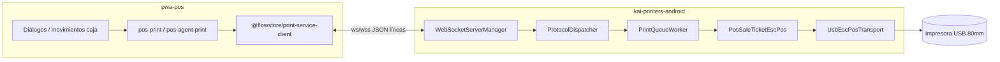

# Arquitectura de impresión

## Diagrama general



## Capas

### 1. `packages/print-service-client`

- `PrintServiceConnection`: WebSocket, `hello`, `print`, eventos `print_job_done` / `print_job_failed`
- `waitForOpen`, `waitForHello`, **`waitForPrintJob`** (espera entrega real del job)
- Tipos de payload: `PosSaleTicketPayload`, formatos `PrintFormat`, presets 58/80/carta/A4
- Config en `localStorage`, mensajes de error humanizados (`formatPrintJobFailedMessage`)

### 2. POS — `pwa-pos/src/features/pos-print/`

| Archivo | Rol |
|---------|-----|
| `pos-agent-print.ts` | `withPrintAgentConnection`, encolado vectorial con fallback de alias |
| `pos-sale-ticket-agent.ts` | Venta → JSON + espera de job |
| `reprint-sale-receipt.ts` | Reimpresión desde caja |
| `pos-sale-document-print.ts` | HTML/PDF documento hoja |
| `html-to-pdf-base64.ts` | Raster documento para agente |

Otros módulos POS (`cash-closing`, `quotations`, etc.) tienen su `*-ticket-agent.ts` con el mismo patrón de encolado.

### 3. Kai Printers Android — `kai-printers-android/`

| Componente | Rol |
|------------|-----|
| `PrintAgentForegroundService` | Servicio en primer plano, levanta WebSocket |
| `ProtocolDispatcher` | `hello`, `print`, `test_print`; valida formato vs perfil papel |
| `AgentRepository` | Cola SQLite (`print_jobs`), mapeo impresoras |
| `PrintQueueWorker` | Mutex global; recupera jobs `printing` obsoletos; timeout 60 s en write |
| `PosSaleTicketEscPos` | JSON → bytes ESC/POS |
| `JsonElementExt` | Lectura segura de JSON con campos `null` |
| `UsbEscPosTransport` | Chunks 1 KB + pausa 5 ms entre chunks |

### 4. Protocolo `print` (ticket venta)

Request (resumido):

```json
{
  "action": "print",
  "purpose": "tickets",
  "format": "ticket_80mm",
  "type": "pos-sale-ticket",
  "ticket": { "version": 1, "folio": "...", "customer": null, "lines": [], ... },
  "filename": "VTA-001.escpos",
  "printerDisplayLabel": "Tickets"
}
```

Response: `{ "jobId": "uuid" }` → eventos asíncronos `print_job_done` / `print_job_failed`.

## Conexión WebSocket

| Entorno | Host típico | Puerto |
|---------|-------------|--------|
| POS y agente en **misma tablet** | `127.0.0.1` | WSS `14568` si POS es HTTPS |
| POS en **PC**, agente en tablet | IP LAN de la tablet | WS `14567` o WSS `14568` |
| Dev desktop sin agente | — | Falla conexión; fallback browser (solo documentos útiles) |

`waitForOpen` distingue:

- `closed_before_open` — agente detenido o host/puerto incorrecto
- `open_timeout` — red lenta o firewall
- Ya no confunde cierre rápido con `not_started` (fix junio 2026)

## Cola de impresión Android

Estados: `queued` → `printing` → `done` | `failed`

- `started_at` al pasar a `printing`
- Al iniciar `drain` o el servicio: `recoverStalePrintingJobs` (>90 s en `printing`)
- Un job colgado en USB bloqueaba toda la cola (mutex); la recuperación mitiga esto

## Transportes

| Transporte | Clase | Notas |
|------------|-------|-------|
| USB | `UsbEscPosTransport` | Permiso USB; bulk OUT; delays en tickets grandes |
| Bluetooth | `BluetoothEscPosTransport` | Emparejamiento previo |
| Red | `NetworkEscPosTransport` | IP:9100 típico |

El mapeo POS alias → `target_system_printer` se resuelve en `AgentRepository.resolvePrinterForPurpose`.
