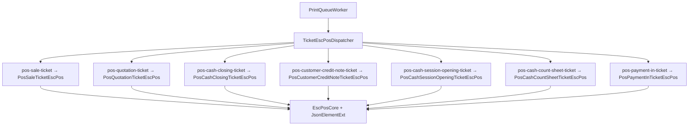

# Renderers ESC/POS — plan y estado

Documento maestro para implementar **un renderer dedicado por tipo de ticket** en Kai Printers Android, con paridad al agente Tauri (`print-service`).

## Problema actual

`PrintQueueWorker.kt` enruta **todos** los `documentType` de ticket al mismo renderer:

```kotlin
// kai-printers-android/.../PrintQueueWorker.kt (hoy)
PosSaleTicketEscPos.fromTicketJson(payload, widthChars)
```

La cola y el protocolo **sí aceptan** siete tipos (`PrintFormats.ticketJobTypes`), pero solo **venta** tiene layout correcto. Si se imprime cotización o arqueo con el renderer de venta:

- Faltan secciones (conteo declarado, vigencia cotización, folios NC, etc.)
- Campos con distinto nombre (`documentNumber` vs `folio`) no aparecen
- No crashea siempre, pero el ticket es **incorrecto o vacío** en partes clave

## Estado por agente

| `type` | Tauri (`print-service`) | Android (`kai-printers-android`) | POS encola |
|--------|-------------------------|-----------------------------------|------------|
| `pos-sale-ticket` | ✅ `pos_sale_ticket_escpos.rs` | ✅ `PosSaleTicketEscPos.kt` | ✅ |
| `pos-quotation-ticket` | ✅ `pos_quotation_ticket_escpos.rs` | ❌ usa venta | ✅ |
| `pos-payment-in-ticket` | ✅ `pos_payment_in_ticket_escpos.rs` | ❌ usa venta | ✅ |
| `pos-customer-credit-note-ticket` | ✅ `pos_customer_credit_note_ticket_escpos.rs` | ❌ usa venta | ✅ |
| `pos-cash-closing-ticket` | ✅ `pos_cash_closing_ticket_escpos.rs` | ❌ usa venta | ✅ |
| `pos-cash-count-sheet-ticket` | ✅ `pos_cash_count_sheet_ticket_escpos.rs` | ❌ usa venta | ✅ |
| `pos-cash-session-opening-ticket` | ✅ `pos_cash_session_opening_ticket_escpos.rs` | ❌ usa venta | ✅ |

**Fuente de verdad del payload JSON:** `packages/print-service-client/src/pos-*-ticket.ts`  
**Referencia de layout ESC/POS:** `print-service/src-tauri/src/pos_*_ticket_escpos.rs`  
**Referencia visual HTML:** `pwa-pos/src/features/*/lib/*-receipt-print.ts` o `*-print.ts`

## Arquitectura objetivo (Android)



### Clases Kotlin previstas

| Clase | Archivo |
|-------|---------|
| `TicketEscPosDispatcher` | `print/TicketEscPosDispatcher.kt` |
| `EscPosCore` (o ampliar `EscPosLayout`) | `print/EscPosCore.kt` |
| `PosQuotationTicketEscPos` | `print/PosQuotationTicketEscPos.kt` |
| `PosCashClosingTicketEscPos` | `print/PosCashClosingTicketEscPos.kt` |
| `PosCustomerCreditNoteTicketEscPos` | `print/PosCustomerCreditNoteTicketEscPos.kt` |
| `PosCashCountSheetTicketEscPos` | `print/PosCashCountSheetTicketEscPos.kt` |
| `PosCashSessionOpeningTicketEscPos` | `print/PosCashSessionOpeningTicketEscPos.kt` |
| `PosPaymentInTicketEscPos` | `print/PosPaymentInTicketEscPos.kt` |

`TicketEscPosDispatcher.fromJob(documentType, json, widthChars): ByteArray` — único punto llamado desde `PrintQueueWorker`.

### Infraestructura compartida

Ver [renderers/INFRAESTRUCTURA-COMPARTIDA.md](./renderers/INFRAESTRUCTURA-COMPARTIDA.md):

- `JsonElementExt` — lectura null-safe (obligatorio en todos los renderers)
- `EscPosLayout` — chars por línea 32/48
- `EscPosBarcode`, `EscPosTail`, `EscPosStreamWriter`
- Helpers a extraer de `PosSaleTicketEscPos` / portar de Tauri: `money`, `divider`, `labelValue`, logo, wrap

### Capabilities en `hello`

Hoy Android declara solo:

```kotlin
// ProtocolConstants.kt
AGENT_CAPABILITIES_MVP = listOf("pos-sale-ticket", "pdf-base64", ...)
```

Al implementar cada renderer, **añadir** la capability correspondiente (como en Tauri) para que el POS pueda validar con `agentSupportsPos*Ticket(hello)`.

## Criterios de aceptación (todos los tipos)

1. **Paridad visual** con ticket HTML del POS (mismas secciones y orden, dentro de límites 58/80 mm).
2. **Paridad funcional** con Tauri ESC/POS (mismo contenido; no exige byte-identical).
3. **JSON con `null`** en campos opcionales — no lanza (tests dedicados por tipo).
4. **58 mm y 80 mm** — `widthChars` 32 y 48.
5. **Código de barras** solo donde el HTML/POS lo incluye (folio / documentNumber).
6. Test unitario `*EscPosTest.kt` con fixture mínimo + fixture con `null` explícitos.
7. Tras implementar venta-caja: aplicar `waitForPrintJob` en el `*-ticket-agent.ts` del POS (hoy solo venta lo tiene).

## Fases de implementación sugeridas

| Fase | Tipos | Prioridad | Motivo |
|------|-------|-----------|--------|
| **0** | Infra: `TicketEscPosDispatcher`, `EscPosCore` | P0 | Evita duplicar init/money/wrap |
| **1** | Cotización, Arqueo, NC | P1 | Uso frecuente en tienda |
| **2** | Apertura, Planilla conteo | P2 | Cierre de caja |
| **3** | PAYMENT_IN | P2 | Más admin que POS; admin ya encola |
| **4** | Logo base64, capabilities hello | P3 | Paridad Tauri completa |
| **5** | `waitForPrintJob` en todos los `*-ticket-agent.ts` | P3 | Misma UX que venta |

## Especificaciones por tipo

| Documento | Enlace |
|-----------|--------|
| Venta (referencia) | [renderers/pos-sale-ticket.md](./renderers/pos-sale-ticket.md) |
| Cotización | [renderers/pos-quotation-ticket.md](./renderers/pos-quotation-ticket.md) |
| Arqueo de caja | [renderers/pos-cash-closing-ticket.md](./renderers/pos-cash-closing-ticket.md) |
| Nota de crédito | [renderers/pos-customer-credit-note-ticket.md](./renderers/pos-customer-credit-note-ticket.md) |
| Planilla de conteo | [renderers/pos-cash-count-sheet-ticket.md](./renderers/pos-cash-count-sheet-ticket.md) |
| Apertura de caja | [renderers/pos-cash-session-opening-ticket.md](./renderers/pos-cash-session-opening-ticket.md) |
| Cobro PAYMENT_IN | [renderers/pos-payment-in-ticket.md](./renderers/pos-payment-in-ticket.md) |

## Archivos POS que encolan (para QA)

| Tipo | Módulo POS |
|------|------------|
| Venta | `pos-print/lib/pos-sale-ticket-agent.ts` |
| Cotización | `quotations/lib/quotation-ticket-agent.ts` |
| Arqueo | `cash-closing/lib/cash-closing-ticket-agent.ts` |
| Planilla | `cash-closing/lib/cash-count-sheet-ticket-agent.ts` |
| Apertura | `cash-session-opening/lib/cash-session-opening-ticket-agent.ts` |
| NC | `customer-credit-notes/lib/customer-credit-note-ticket-agent.ts` |
| PAYMENT_IN | `pwa-admin` → `admin-payment-in-ticket-print.ts` |

## Admin

`pwa-admin` también encola cotización, venta/backorder y PAYMENT_IN con los mismos `type` y payloads. Los renderers Android deben servir **POS y admin** sin bifurcar protocolo.
