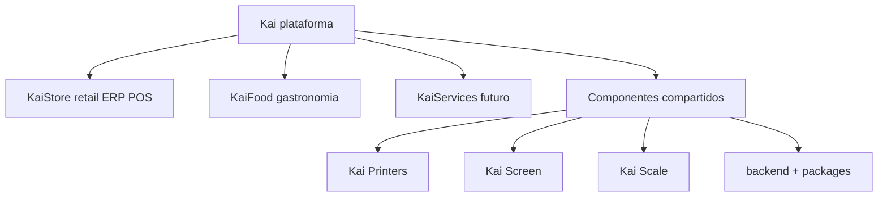
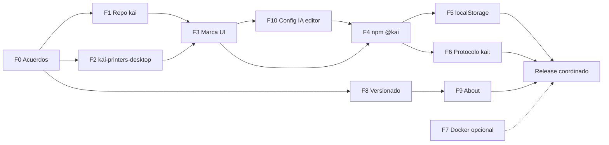

# Migración de nombres — Flow Store → Kai (plataforma)

**Estado:** borrador · **Última revisión:** junio 2026  
**Propósito:** definir y acordar **todos los cambios de naming** antes de ejecutarlos en el monorepo. Este documento es la fuente de verdad del plan; no reemplaza PRs ni commits.

> **Nombre del archivo:** `MIGRACION-NOMBRES-KAISTORE.md` (histórico). El alcance cubre la **plataforma Kai** completa, no solo retail.

---

## 0. Modelo de marca (acordado en principio)

El monorepo **no es un solo producto**. Es la **plataforma Kai**, con verticales y componentes compartidos.

| Nivel | Nombre | Uso |
|-------|--------|-----|
| **Marca paraguas** | **Kai** | Empresa, plataforma, repo, scope npm, storage, protocolo |
| **Productos** | **KaiStore**, **KaiFood**, **KaiServices** (futuro) | UI, marketing, `NEXT_PUBLIC_KAI_PRODUCT_MODE`, títulos PWA |
| **Componentes transversales** | Kai Printers, Kai Screen, Kai Scale | Agentes y clientes compartidos entre productos |
| **Comercial (opcional)** | *Suite Kai* / *Kai Suite* | Solo copy comercial — **no** nombre de repo, npm ni carpetas |



**Reglas de naming:**

- Infra y código compartido → **Kai** (`kai`, `@kai/*`, `kai.*` en storage).
- Texto visible al usuario → **producto** según modalidad (`KaiStore POS`, `KaiFood POS`, etc.).
- No renombrar el monorepo a `kaistore` si el repo alberga KaiFood y KaiServices.

Referencias actuales en código: [`ARQUITECTURA_Y_ECOSISTEMA.md`](./ARQUITECTURA_Y_ECOSISTEMA.md) (`kaistore` \| `kaifood`), [`KAISTORE_ROADMAP.md`](../legacy/KAISTORE_ROADMAP.md).

---

## Cómo usar este documento

1. **Revisar** las decisiones pendientes (sección 2) y marcar la opción elegida.
2. **Ajustar** el alcance por fase si algo no aplica o falta algo.
3. **Ejecutar** fase por fase; al cerrar una fase, actualizar la tabla de seguimiento (§8).
4. **No mezclar** fases de alto riesgo (storage, protocolo, Docker) con cambios cosméticos en un solo PR gigante.
5. **F8, F9 y F10** pueden avanzar **en paralelo** a F1; no bloquean el rename del repo.

---

## 1. Situación actual vs objetivo

| Ámbito | Hoy | Objetivo propuesto | ¿Decidido? |
|--------|-----|-------------------|------------|
| **Marca paraguas** | Flow Store / mezcla | **Kai** | ✅ Acordado |
| **Producto retail** | Flow Store / KaiStore | **KaiStore** (vertical, sin cambiar) | ✅ |
| **Producto gastronomía** | Planificado | **KaiFood** (`kaifood`) | ✅ (roadmap) |
| **Producto servicios** | — | **KaiServices** (futuro) | ⬜ Sin fecha |
| **Repositorio GitHub** | `felipechandiadev/flow-store-2` | **`felipechandiadev/kai`** (rename) | ✅ `kai` |
| **URL clone** | `…/flow-store-2.git` | `…/kai.git` (o `kai-platform.git`) | ⬜ |
| **Carpeta deploy VPS** | `~/flow-store-2` | `~/kai` (opcional; puede quedar ruta vieja) | ⬜ |
| **Scope npm interno** | `@flowstore/*` (+ `@kaistore/kai-printers-brand`) | **`@kai/*`** unificado | ⬜ Pendiente ejecutar |
| **Agente Tauri (carpeta)** | `print-service/` (gitignored) | **`kai-printers-desktop/`** | ⬜ |
| **Par Android** | `kai-printers-android/` | Sin cambio | ✅ |
| **Producto desktop** | KaiPrinters | Sin cambio | ✅ |
| **Identificador app** | `com.kaistore.kaiprinters` | Mantener por ahora; evolución opcional a `com.kai.*` | ⬜ Fase tardía |
| **Cliente WebSocket** | `packages/print-service-client` | Ver §2.5 | ⬜ |
| **Icono / brand assets** | Varios PNG legacy | `assets/brand/kai-store/source/kai-logo.svg` | ✅ Hecho |
| **Versionado unificado** | Disperso por app (ver §4 F8) | SemVer + build id + reglas release | ⬜ |
| **Pantalla About / Acerca de** | Parcial (admin/stock sidebar) | About en todas las apps (§4 F9) | ⬜ |
| **Config IA / editor** | Era Copilot; logs Cursor en git | F10: limpiar `.cursor`, consolidar reglas | ✅ |

### 1.1 ¿Listos para ejecutar?

| Ámbito | ¿Listo? | Notas |
|--------|---------|-------|
| **F1 — Repo / URL GitHub** | **Casi** | Falta cerrar §2.1: nombre `kai` vs `kai-platform` y rename vs repo nuevo |
| **F2 — kai-printers-desktop** | ⬜ | Independiente del repo; avisar a devs con carpeta local |
| **F3 — Marca UI** | ⬜ | Puede ir en paralelo tras F1 |
| **F4 — npm `@kai`** | ⬜ | PR grande; no mezclar con F5/F6 |
| **F5 + F6 — storage + protocolo** | **No** | Requiere checklist §9, ventana de deploy y migración dual |
| **F7 — Docker** | ⬜ | Opcional; posponer |
| **F8 — Versionado** | ⬜ | **No bloquea F1**; conviene antes de release comercial |
| **F9 — About** | ⬜ | **No bloquea F1**; conviene antes de release comercial |
| **F10 — Config IA / editor** | 🔄 | **Felipe** — limpiar `.cursor` logs, gitignore, reglas Cursor (paralelo F3) |

**Conclusión:** se puede **arrancar F1** (rename GitHub + PR infra + VPS) en cuanto se elija nombre de repo. **No** hacer un único “big bang” con F5, F6, F4 y rename juntos.

**Repo nuevo vs rename:**

| Estrategia | Nueva URL | Cuándo |
|------------|-----------|--------|
| **Rename (recomendado)** | `github.com/…/kai.git` | Mismo repo; GitHub redirige `flow-store-2` un tiempo |
| **Repo nuevo** | URL nueva vacía | Solo si se necesita historial git limpio; más fricción |

---

## 2. Decisiones pendientes (definir antes de ejecutar)

### 2.1 Repositorio GitHub

| Opción | Descripción | Recomendación |
|--------|-------------|---------------|
| **A — Rename** | Settings → Rename `flow-store-2` → `kai` o `kai-platform` | ✅ **Preferida** — conserva issues, PRs, deploy keys |
| **B — Repo nuevo** | Crear repo vacío y push | Solo si se necesita historial limpio |

**Decisión:** ✅ A (rename)  
**Nombre final del repo:** ✅ `kai`

**No usar** `kaistore` como nombre de repo — implica solo retail y choca con KaiFood / KaiServices.

### 2.2 Dominio, emails y cookies

| Elemento | Hoy | Propuesta | Decisión |
|----------|-----|-----------|----------|
| Emails seed | `@flowstore.local` | `@kai.local` | ✅ Sí |
| Swagger prod | `api.flowstore.com` | `api.kai.cl` o subdominio por producto | ⬜ _________ |
| Cookies NextAuth | `…flowstore-admin`, `…flowstore-pos`, etc. | `…kai-admin`, `…kai-pos`, etc. | ✅ Sí — re-login en F5 |
| Título PWA | Mezcla | Según `KAI_PRODUCT_MODE`: KaiStore / KaiFood / … | ✅ Patrón acordado |

### 2.3 Docker / PostgreSQL local

| Elemento | Hoy | Cambiar | Riesgo |
|----------|-----|---------|--------|
| `POSTGRES_DB` | `flow-store` | `kai` | **Alto** — volumen existente |
| `POSTGRES_USER` | `flowstore` | `kai` | **Alto** |
| `container_name` | `flow-store-postgres` | `kai-postgres` | Bajo |
| Red Docker | `flow-store-network` | `kai-network` | Bajo |

**Decisión:** ✅ Mantener nombres Docker internos (F7 pospuesto)

**Recomendación:** posponer (F7) salvo entorno dev nuevo.

### 2.4 Protocolo WebSocket Kai Printers

Eventos que hoy usan prefijo `flowstore:`:

| Constante | Ubicación |
|-----------|-----------|
| `flowstore:service_stopped` | `print-service-client`, Android |
| `flowstore:print-service-config-changed` | `print-service-client` |
| `flowstore:print-service-notifications:*` | localStorage POS/admin |
| `flowstore:print-service-job-failed` | CustomEvent |
| `flowstore:admin-document-print-modes-changed` | admin |
| `flowstore:pos-document-print-modes-changed` | POS |

**Decisión:** ✅ Migrar a `kai:` con compatibilidad dual (F6)

**Recomendación:** `kai:` + dual-read en agentes (compartido entre KaiStore y KaiFood).

### 2.5 Paquete `print-service-client`

| Opción | Nombre carpeta | Nombre npm | Impacto |
|--------|----------------|------------|---------|
| **Conservar** | `print-service-client` | `@kai/print-service-client` | Menos churn en paths |
| **Renombrar** | `kai-printers-client` | `@kai/kai-printers-client` | Más coherente con Kai Printers |

**Decisión:** ✅ Conservar carpeta `print-service-client` → `@kai/print-service-client`

### 2.6 Paquete `@kaistore/kai-printers-brand`

Hoy existe scope `@kaistore` en un solo paquete. **Objetivo:** alinear a `@kai/kai-printers-brand` en F4 (junto al resto).

### 2.7 Versionado (F8)

| Elemento | Hoy | Propuesta | Decisión |
|----------|-----|-----------|----------|
| Esquema | SemVer informal, versiones distintas por `package.json` | **SemVer** por app/servicio + metadata de build | ⬜ |
| Versión plataforma | No existe | Tag git / archivo `VERSION` opcional en raíz | ⬜ Sí / ⬜ No |
| Build id en PWAs | Inconsistente | `NEXT_PUBLIC_BUILD_ID` (git sha corto + fecha CI) | ⬜ |
| Backend en `/health` | Sin versión de app | Incluir `version` desde `package.json` o env | ⬜ |
| Herramienta release | Manual | Manual + script sync; **Changesets** más adelante (opcional) | ⬜ |

**Recomendación:** F8 en paralelo a F1–F3; no esperar al rename para documentar reglas.

### 2.8 About / Acerca de (F9)

| Elemento | Hoy | Propuesta | Decisión |
|----------|-----|-----------|----------|
| Admin / Stock | `vX` en sidebar | Diálogo **Acerca de** en Configuración | ⬜ |
| POS / eShop | Sin About | About en settings o footer | ⬜ |
| Versión backend | No en UI | Sí tras F8.T5 (`GET /health`) | ⬜ |
| Agentes (Printers, Screen) | No en UI | Versión en About POS/admin si conectado | ⬜ |

**Recomendación:** F9 en paralelo a F1; ver tareas en §4 F9.

### 2.9 Config IA y editor (F10)

> Evaluación de `.cursor/`, `.github/`, `.instructions/`, `.vscode/` (junio 2026). **Responsable:** Felipe.

| Elemento | Hoy | Propuesta | Decisión |
|----------|-----|-----------|----------|
| Reglas agente | `.instructions/` + `.cursor/rules` + duplicados legacy | `.cursor/rules/*.mdc` + `AGENTS.md` como fuente principal | ⬜ |
| Logs Cursor en git | `debug-*.log` trackeados | Ignorar y borrar del historial activo | ⬜ |
| `.vscode/settings.json` | Trackeado vs gitignore | Compartir en repo / solo local | ⬜ |
| Texto “Copilot” | README, `.instructions` | “Cursor / agentes IA” | ⬜ F3 + F10 |

---

## 3. Mapa de nomenclatura objetivo

```
Monorepo (GitHub)
└── kai/                               ← rename desde flow-store-2 (NO kaistore)
    ├── backend/                       ← compartido KaiStore + KaiFood + …
    ├── pwa-admin/                     ← título según KAI_PRODUCT_MODE
    ├── pwa-pos/
    ├── pwa-eshop/
    ├── pwa-stock/
    ├── kai-printers-android/
    ├── kai-printers-desktop/          ← rename desde print-service/
    ├── assets/
    │   ├── brand/kai-store/           ← logo paraguas Kai (SVG)
    │   └── integrations/              ← terceros (MP, etc.)
    └── packages/
        ├── @kai/kai-brand
        ├── @kai/kai-printers-brand
        ├── @kai/kai-printers-client   ← (ex print-service-client, TBD §2.5)
        ├── @kai/document-print
        ├── @kai/customer-display-client
        ├── @kai/scale-service-client
        └── kai-printers-release/
```

**Convención de nombres:**

| Tipo | Patrón | Ejemplo |
|------|--------|---------|
| Plataforma / repo / npm | `kai`, `@kai/*` | repo `kai`, `@kai/kai-brand` |
| Producto (UI, marketing) | `Kai<Vertical>` | KaiStore, KaiFood, KaiServices |
| Modalidad runtime | `kaistore` \| `kaifood` \| … | `NEXT_PUBLIC_KAI_PRODUCT_MODE` |
| App / agente local | `kai-<función>-<plataforma>` | `kai-printers-desktop` |
| Storage browser | `kai.<app>.<feature>.vN` | `kai.pos.cart.v1` |
| Eventos DOM/WS | `kai:<evento>` | `kai:service_stopped` |
| Comercial | *Suite Kai* | Solo web, propuestas, no código |

---

## 4. Fases de ejecución (alcance detallado)

### Fase 0 — Documentación y acuerdos

| ID | Tarea | Archivos / notas | Estado |
|----|-------|------------------|--------|
| F0.T1 | Modelo de marca §0 + cerrar decisiones §2 | Este documento | 🔄 |
| F0.T2 | Enlazar desde `docs/README.md` | Índice docs | ✅ |
| F0.T3 | Comunicar al equipo: no renombrar ad-hoc | — | ⬜ |
| F0.T4 | Icono paraguas Kai (SVG → apps) | `assets/brand/`, `npm run brand:icons` | ✅ |

---

### Fase 1 — Repositorio e infraestructura Git

**Prerrequisito:** decisión §2.1 en GitHub (rename manual).

| ID | Cambio | Archivos afectados |
|----|--------|-------------------|
| F1.T1 | URL repo SSH/HTTPS | `deploy/vps-git-setup.sh`, `docs/vps-git-setup.md` |
| F1.T2 | `DEPLOY_DIR`, comentarios, curl raw | Idem + scripts deploy |
| F1.T3 | `README.md` raíz — **Kai Platform**, clone, estructura por producto | `README.md` |
| F1.T4 | Remotes locales / VPS | `git remote set-url origin …` |
| F1.T5 | Deploy keys GitHub | Verificar tras rename |
| F1.T6 | Docs: quitar `flow-store-2`; describir Kai + verticales | `docs/README.md`, `ARQUITECTURA_Y_ECOSISTEMA.md` |

**No incluye:** npm scope ni localStorage.

---

### Fase 2 — Carpeta agente desktop

**Prerrequisito:** carpeta local `print-service/` en máquinas que compilan Tauri.

| ID | Cambio | Archivos afectados |
|----|--------|-------------------|
| F2.T1 | Renombrar carpeta local | `print-service/` → `kai-printers-desktop/` |
| F2.T2 | `.gitignore` | paths actualizados |
| F2.T3 | Script publish | `packages/kai-printers-release/scripts/publish-to-pos-downloads.mjs` |
| F2.T4 | Workflows CI | `.github/workflows/print-service*.yml` |
| F2.T5 | Docs impresión | `docs/printers/**`, READMEs downloads |
| F2.T6 | Kai brand | `packages/kai-brand/scripts/generate-all.mjs` (path desktop) |

**Opcional (2b):** crate Rust `kai_printers_desktop`; renombrar workflows a `kai-printers-desktop*.yml`.

---

### Fase 3 — Marca visible y textos

| ID | Cambio | Ámbito |
|----|--------|--------|
| F3.T1 | "Flow Store" → **Kai** (genérico) o **KaiStore/KaiFood** (por producto) | UI, layouts, PWA metadata |
| F3.T2 | README: plataforma Kai + sección por vertical | `docs/project/*`, AGENTS |
| F3.T3 | Swagger / ejemplos | `swagger.config.ts`, DTOs |
| F3.T4 | Seeds — emails `@kai.local` | Si §2.2 = Sí |
| F3.T5 | Reglas agente / copy Copilot → Cursor | `.instructions/*`, `README`, F10 |

**No** unificar todo como "KaiStore" — respetar `KAI_PRODUCT_MODE`.

---

### Fase 4 — Scope npm `@flowstore` / `@kaistore` → `@kai`

| Paquete actual | Nombre propuesto |
|----------------|------------------|
| `@flowstore/kai-brand` | `@kai/kai-brand` |
| `@flowstore/document-print` | `@kai/document-print` |
| `@flowstore/print-service-client` | `@kai/…` (§2.5) |
| `@flowstore/customer-display-client` | `@kai/customer-display-client` |
| `@flowstore/scale-service-client` | `@kai/scale-service-client` |
| `@kaistore/kai-printers-brand` | `@kai/kai-printers-brand` |

| ID | Tarea |
|----|-------|
| F4.T1–F4.T5 | Igual que antes: package.json, deps, next.config aliases, lockfiles, imports (~80+ archivos) |

---

### Fase 5 — localStorage, cookies y sesión

Prefijo objetivo: **`kai.`** / **`kai-`** (plataforma, no solo retail).

Inventario legacy `flowstore*` — sin cambios respecto al listado anterior (POS, admin, stock, NextAuth).

| ID | Tarea |
|----|-------|
| F5.T1 | Prefijo `kai.` acordado |
| F5.T2 | Migración al leer (copiar key vieja → nueva) |
| F5.T3 | Lectura dual 1–2 releases (opcional) |
| F5.T4 | Ventana re-login cookies |
| F5.T5 | Tests storage |

**Riesgo:** alto — desplegar POS + admin juntos.

---

### Fase 6 — Protocolo Kai Printers

Solo si §2.4 = migrar a `kai:`.

Mismos componentes (cliente TS, Tauri, Android, fixtures). Cutover coordinado con F5 si es posible.

---

### Fase 7 — Docker / backend dev (opcional)

Renombrar a `kai` / `kai-postgres` / `kai-network`. Posponer salvo fresh install.

---

### Fase 8 — Versionado unificado

**Objetivo:** una sola política de versiones para soporte, About y releases. **No bloquea F1** (rename repo).

#### Estado actual (baseline)

| Componente | `package.json` / fuente | UI / API |
|------------|-------------------------|----------|
| `backend` | `0.0.1` | `/health` sin versión |
| `pwa-admin` | `0.1.0` | Sidebar; fallback hardcode **`2.1.0`** |
| `pwa-pos` | `1.0.0` | Sin versión en UI |
| `pwa-stock` | `1.0.0` | Sidebar vía `next.config` → `NEXT_PUBLIC_APP_VERSION` |
| `pwa-eshop` | `0.1.0` | Solo en `.env.example` |
| Kai Printers Android | `version.properties` | Build + protocolo WS |
| Kai Printers desktop | `tauri.conf.json` | Agente local |
| Paquetes `@flowstore/*` | `0.0.1` dispersos | — |

#### Reglas propuestas (SemVer)

| Nivel | Qué versiona | Ejemplo | Cuándo subir |
|-------|---------------|---------|--------------|
| **App PWA** | `pwa-*/package.json` | `1.2.3` | Cada deploy de esa PWA |
| **Backend** | `backend/package.json` | `0.4.0` | API o lógica servidor |
| **Agente nativo** | `versionName` + `versionCode` (Android) | `1.0.2` / `102` | Cada release APK/desktop |
| **Paquetes internos** | `packages/*/package.json` | `0.1.0` | Breaking en API del paquete |
| **Build metadata** | CI → env | `a1b2c3d` + ISO date | Cada build; no es SemVer |
| **Plataforma (opcional)** | Tag git monorepo | `2026.6.1` o `1.0.0` | Release conjunto documentado |

**Política de incremento:**

- **PATCH** — fix en una app → solo esa versión + deploy de esa app.
- **MINOR** — feature backend + consumidores → backend + PWAs afectadas.
- **MAJOR** — breaking (F5 storage, F6 protocolo, cambios API) → release coordinado + notas.

#### Tareas F8

| ID | Tarea | Entregable |
|----|-------|------------|
| F8.T1 | Documento reglas (esta sección + [`VERSIONING.md`](./VERSIONING.md) cuando exista) | Política acordada |
| F8.T2 | Unificar inyección `NEXT_PUBLIC_APP_VERSION` en **todas** las PWAs (`next.config.ts` desde `package.json`) | Mismo patrón que `pwa-stock` |
| F8.T3 | Eliminar fallback hardcode `2.1.0` en admin | Una sola fuente de verdad |
| F8.T4 | `NEXT_PUBLIC_BUILD_ID` / `NEXT_PUBLIC_BUILD_DATE` en CI (opcional) | Trazabilidad soporte |
| F8.T5 | Backend: `GET /health` incluye `version` (y opcional `gitSha`) | About + monitoreo |
| F8.T6 | Script raíz `npm run version:sync` (opcional) — alinear lectura para About | DX |
| F8.T7 | Alinear manifests PWA / Android / Tauri en release checklist | Tabla por release |

**Herramientas futuras (fuera de alcance inicial):** [Changesets](https://github.com/changesets/changesets), release-please, tags automáticos en GitHub.

---

### Fase 9 — About / Acerca de (todas las apps)

**Objetivo:** pantalla o diálogo consistente para soporte, auditoría y confianza del usuario. **No bloquea F1.**

#### Contenido mínimo del About

| Campo | Fuente |
|-------|--------|
| Marca **Kai** + producto (**KaiStore** / **KaiFood** / …) | `NEXT_PUBLIC_KAI_PRODUCT_MODE` + copy |
| Versión app PWA | `NEXT_PUBLIC_APP_VERSION` |
| Build (opcional) | `NEXT_PUBLIC_BUILD_ID` |
| Versión backend | `GET /api/health` → `version` (F8.T5) |
| Kai Printers (si conectado) | `print-service-client` / health push agente |
| Kai Screen (opcional) | `customer-display-client` |
| Copyright / soporte | Config estática o env |

#### Estado actual vs objetivo

| App | Hoy | Objetivo F9 |
|-----|-----|-------------|
| `pwa-admin` | `vX` en sidebar | **Configuración → Acerca de** (+ mantener o quitar línea sidebar) |
| `pwa-pos` | Nada | **Configuración → Acerca de** |
| `pwa-stock` | `vX` en sidebar | **Configuración → Acerca de** |
| `pwa-eshop` | Nada | Footer link o `/acerca` |
| Agentes | Versión en agente | Reflejada en About de POS/admin si online |

#### Tareas F9

| ID | Tarea | Archivos / notas |
|----|-------|------------------|
| F9.T1 | Componente compartido `KaiAppAboutDialog` (o paquete post-F4) | `shared/` o `@kai/app-info` |
| F9.T2 | Admin — enlace en settings | `pwa-admin/app/(app)/settings/…` |
| F9.T3 | POS — enlace en settings | `pwa-pos/.../settings/…` |
| F9.T4 | Stock — enlace en settings | `pwa-stock/...` |
| F9.T5 | eShop — footer o página | `pwa-eshop/` |
| F9.T6 | Integrar lectura backend + agente impresión | Fetch health + `usePrintServiceConnection` |
| F9.T7 | Tests smoke / snapshot mínimo | Opcional |

**Dependencias:** F8.T2–T5 recomendadas antes de F9.T6; F9.T1 puede empezar con versión solo de env.

---

### Fase 10 — Config IA, editor y CI auxiliar (`.cursor`, `.instructions`, `.vscode`)

**Responsable:** Felipe · **Estado:** en curso

**Contexto:** el repo hereda carpetas de la era **GitHub Copilot**. Hoy el equipo usa **Cursor** (y `AGENTS.md` por app). No conviene borrar todo; sí **limpiar basura** y **consolidar reglas**.

**No bloquea F1** — puede ejecutarse en paralelo a F3.

#### Evaluación por carpeta (baseline junio 2026)

| Carpeta | ¿En uso? | ¿Eliminar? | Contenido / notas |
|---------|----------|------------|-------------------|
| **`.github/`** | **Sí — CI activo** | **No** | Workflows: `kai-printers-android`, `kai-screen-android`, `print-service`, `print-service-release`, `scale-service-client` |
| **`.instructions/`** | **Sí — referenciado** | **No** (aún) | `backend.instruction`, `webadmin.instruction` — CQRS/Server Actions. Citado en `README`, `docs/README`, `AGENTS.md`, arquitectura. Encabezado dice “Copilot” pero aplica a Cursor |
| **`.cursor/`** | **Parcial** | **Parcial** | `rules` (formato legacy, un solo archivo); `debug-*.log` (~700 KB, **no deben estar en git**); `plans/*.plan.md` (planes viejos de agente) |
| **`.vscode/`** | **Mínimo** | **Opcional** | Solo `settings.json` (CSS `@tailwind` lint + Java Android). **No es Copilot**. En `.gitignore` pero el archivo ya está trackeado (inconsistencia) |

**Duplicación actual:** `.instructions/*` ≈ `docs/legacy/*INSTRUCTIONS*` ≈ resumen en `pwa-*/AGENTS.md` ≈ `.cursor/rules`.

**Copilot vs Cursor:** no hay carpeta `.github/copilot-instructions.md`. Lo “Copilot” es solo texto legacy en README e instrucciones.

#### Detalle `.cursor/` (archivos)

| Archivo | En git | Acción |
|---------|--------|--------|
| `rules` | Sí | Reglas proyecto (formato **viejo**: un solo archivo). Migrar a `.cursor/rules/kai-platform.mdc` |
| `debug-*.log` | Sí (~700 KB) | **Eliminar del repo** — no deben versionarse |
| `plans/*.plan.md` | Sí | Planes viejos de agente; borrar o gitignore `.cursor/plans/` |

`.cursor/` **no está en `.gitignore`**, por eso se colaron logs y plans.

#### Dónde lee el agente hoy (Cursor)

| Fuente | Rol |
|--------|-----|
| `pwa-admin/AGENTS.md`, `pwa-pos/AGENTS.md`, `pwa-eshop/AGENTS.md` | Reglas por app |
| `.instructions/backend.instruction`, `webadmin.instruction` | CQRS / Server Actions (texto “Copilot”) |
| `.cursor/rules` | Reglas monorepo (legacy) |
| `docs/legacy/*INSTRUCTIONS*` | Duplicado histórico |
| `~/.cursor/skills-cursor/` | Skills de usuario (**fuera del repo**) |

#### Copilot-era vs hoy

| Legacy (texto Copilot) | ¿Sigue sirviendo para Cursor? |
|------------------------|-------------------------------|
| `.instructions/*` | Sí |
| `.cursor/rules` | Sí |
| `docs/legacy/*INSTRUCTIONS*` | Sí (duplicado) |
| `README` § “Agentes de Copilot” | Renombrar en F3 + F10 |

#### Qué hacer (resumen)

| Acción | Prioridad |
|--------|-----------|
| **Mantener** `.github/workflows/` | Obligatorio |
| **Eliminar del repo** `.cursor/debug-*.log` | Alta |
| **Gitignore** `.cursor/*.log`, opcional `.cursor/plans/` | Alta |
| **No borrar** `.instructions/` hasta tener reglas unificadas | — |
| **Consolidar** reglas en `.cursor/rules/*.mdc` + `AGENTS.md` | Media (post-F3) |
| **Renombrar copy** “Copilot” → “Cursor / agentes IA” en README e instrucciones | Media (F3) |
| **`.vscode/settings.json`:** mantener compartido **o** quitar del repo y dejar solo settings personales | Baja |

#### Respuesta directa (acordada)

- **No eliminar** `.github/` ni `.instructions/` de golpe.
- **Sí limpiar** `.cursor` (logs y, si aplica, plans viejos).
- **`.vscode/`** es opcional y **no es Copilot** — decidir si compartir `settings.json`.

#### Tareas F10

| ID | Tarea | Archivos / notas |
|----|-------|------------------|
| F10.T1 | Quitar del repo `.cursor/debug-*.log` | `git rm` + no volver a commitear |
| F10.T2 | Actualizar `.gitignore`: `.cursor/*.log`; opcional `.cursor/plans/` | Raíz |
| F10.T3 | Revisar planes viejos en `.cursor/plans/` — borrar o archivar | Solo si no aportan |
| F10.T4 | Migrar `.cursor/rules` → `.cursor/rules/kai-platform.mdc` (formato Cursor actual) | Contenido alineado a Kai, no Flow Store |
| F10.T5 | Decidir fuente única de reglas agente: `.cursor/rules/` + `AGENTS.md`; marcar `.instructions/` como **deprecated** en README | Tras F10.T4 |
| F10.T6 | Actualizar `README.md`, `docs/project/ARQUITECTURA_Y_ECOSISTEMA.md`: “agentes IA / Cursor”, no solo Copilot | Enlaza con F3 |
| F10.T7 | Resolver `.vscode/`: commitear solo `settings.json` con excepción en gitignore **o** eliminar del repo | Decisión equipo |
| F10.T8 | Documentar en `docs/project/` mapa “dónde lee el agente” (1 página corta) | DX onboarding |

**Fuera de alcance F10:** skills de usuario en `~/.cursor/skills-cursor/` (no viven en el repo).

---

| Carpeta | Legacy | Fase |
|---------|--------|------|
| `deploy/` | flow-store-2 URLs | F1 |
| `.github/workflows/` | print-service | F2 |
| `packages/kai-printers-release/` | print-service path | F2 |
| `packages/print-service-client/` | @flowstore, flowstore: | F4, F5, F6 |
| `packages/*-client/` | scope, storage | F4, F5 |
| `pwa-*` | imports, storage, cookies, títulos producto | F3, F4, F5 |
| `backend/` | docker, seeds, swagger | F3, F7 |
| `assets/brand/` | kai-logo.svg | ✅ |
| `docs/` | Flow Store, flow-store-2 | F1, F3 |
| `pwa-*` | versión UI inconsistente | F8, F9 |
| `.cursor/` | logs, rules legacy, plans | F10 |
| `.instructions/` | texto Copilot, duplicado | F10, F3 |
| `.vscode/` | gitignore vs trackeado | F10 |
| `.github/workflows/` | print-service naming | F2 (CI **mantener**) |

**Estimación:** ~150+ archivos con referencia legacy; F8/F9 ~15–25 archivos; F10 ~10–15 archivos + borrado de logs.

---

## 6. Orden recomendado de ejecución



| Orden | Fase | PRs sugeridos | Bloquea F1 |
|-------|------|---------------|------------|
| 1 | F0 | Este doc + icono Kai ✅ | — |
| 2 | **F1** | Infra Git/VPS/README → repo **kai** | — |
| 2b | **F8** | Reglas + sync versión PWAs + health (paralelo a F1) | No |
| 2c | **F9** | About admin/POS/stock/eshop (paralelo; tras F8 parcial) | No |
| 3 | F2 | gitignore + CI + desktop rename | No |
| 4 | F3 | Textos: Kai + KaiStore/KaiFood por modo | No |
| 4b | **F10** | Limpiar `.cursor` logs; reglas Cursor; Copilot→IA (paralelo F3) | No |
| 5 | F4 | `@kai/*` mecánico | No |
| 6 | F5 + F6 | Mismo release POS + admin + impresoras | No |
| 7 | F7 | Cuando convenga | No |

---

## 7. Riesgos y mitigaciones

| Riesgo | Mitigación |
|--------|------------|
| Repo llamado `kaistore` limita KaiFood | Usar **`kai`** o **`kai-platform`** |
| Confusión Kai vs KaiStore en UI | Genérico = Kai; vertical = KaiStore/KaiFood en títulos |
| VPS sin pull tras rename | Actualizar remote el mismo día |
| Pérdida carrito POS | Migración storage F5.T2 |
| Impresión rota | Dual-read protocolo `flowstore:` + `kai:` |
| `@kaistore` huérfano en kai-printers-brand | Incluir en F4 |
| Versiones contradictorias (admin `2.1.0` vs package) | F8.T2–T3 |
| Soporte sin saber qué build corre | F8 build id + F9 About |
| Reglas agente contradictorias (4 fuentes) | F10 consolidación |
| Logs Cursor inflando repo | F10.T1–T2 |

---

## 8. Seguimiento de fases

| Fase | Descripción | Estado | PR / notas |
|------|-------------|--------|------------|
| F0 | Acuerdos + icono Kai | ✅ | F0.T4 ✅; §9 cerrado jun 2026 |
| F1 | Repo **kai** + deploy | ✅ | README, deploy, docs; rename GitHub manual |
| F2 | `kai-printers-desktop/` | ✅ | gitignore, CI, scripts |
| F3 | Marca Kai + verticales en UI | ✅ | Swagger, seeds, README |
| F4 | `@kai/*` npm | ✅ | 6 paquetes + imports |
| F5 | localStorage + cookies | ✅ | dual-read kai.* |
| F6 | Protocolo `kai:` | ✅ | dual-read client + Android |
| F7 | Docker (opcional) | ⬜ | Pospuesto |
| F8 | Versionado unificado | ✅ | VERSIONING.md, health, PWAs |
| F9 | About todas las apps | ✅ | admin/POS/stock/eshop |
| F10 | Config IA / `.cursor` / instrucciones | ✅ | logs, rules mdc, AGENT-RULES-MAP |

---

## 9. Checklist pre-ejecución (cerrar F0)

### Naming y repo

- [x] Marca paraguas: **Kai** (Suite Kai solo comercial)
- [x] Nombre repo: **`kai`**
- [x] Estrategia repo: **rename**
- [x] Prefijo storage: **`kai.`** / **`kai-`**
- [x] Protocolo WS: **`kai:` + dual-read**
- [x] Paquete cliente: **conservar** `print-service-client`
- [x] Docker: **posponer** (F7)
- [ ] Fecha ventana deploy F5+F6: _________
- [ ] Responsable VPS / remotes: Felipe

### Versionado (F8)

- [x] Política SemVer por app aceptada
- [ ] Versión plataforma en tag/`VERSION`: no (inicial)
- [ ] `NEXT_PUBLIC_BUILD_ID` en CI: opcional (F8.T4)
- [x] Versión en `GET /health`: sí

### About (F9)

- [x] About en admin, POS, stock, eShop acordado
- [x] Mostrar versión backend + agentes en About: sí

### Config IA y editor (F10)

- [ ] Eliminar `.cursor/debug-*.log` del repo
- [ ] Gitignore logs/plans Cursor
- [ ] Fuente única reglas: `.cursor/rules/` + `AGENTS.md`
- [ ] Deprecar `.instructions/` (cuándo: _________)
- [ ] `.vscode/settings.json`: compartir / quitar del repo
- [x] Responsable F10: **Felipe**

---

## 10. Referencias

- [Arquitectura y ecosistema](./ARQUITECTURA_Y_ECOSISTEMA.md) — KaiStore vs KaiFood
- [Roadmap producto KaiStore/KaiFood](../legacy/KAISTORE_ROADMAP.md)
- [Setup Git VPS](../vps-git-setup.md)
- [Brand assets](../../assets/brand/kai-store/README.md)
- [Impresión](../printers/README.md)
- [Roadmap implementaciones futuras](../implementaciones-futuras/ROADMAP.md)

---

*Documento vivo — editar aquí antes de abrir PRs de migración.*
