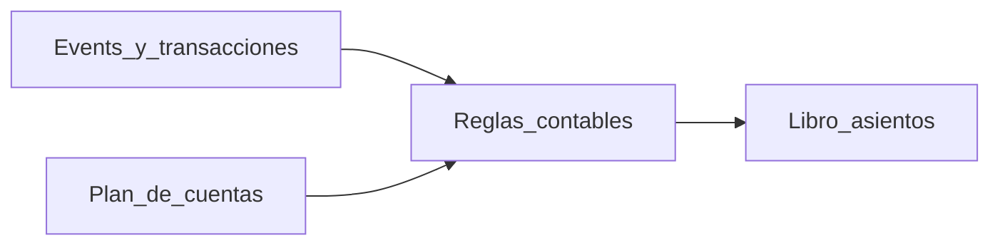

# Contabilidad (`kai-admin`) — secciones y características

Este documento describe qué debería incluir **cada pantalla** del menú **Contabilidad** cuando el módulo esté completo. Hoy varias rutas son *placeholders* (`ErpPlaceholderPage`); **Impuestos** es la referencia de una sección implementada.

Ámbito del producto: ERP con **plan de cuentas**, **reglas contables por evento/transacción**, **libro mayor / asientos**, **impuestos**, y **reportes**. En backend, las reglas se modelan como `accounting_rules` (véase API `accounting/rules`) y referencian cuentas de débito/crédito.

---

## Convenciones UX comunes (todas las secciones)

- **Contexto de empresa**: filtros y acciones usan la empresa activa (company) del contexto multi-tenant.
- **Listados**: búsqueda, filtros, paginación, orden, columnas configurables cuando aplique.
- **Estados**: activo/inactivo o borrado lógico según entidad; acciones de desactivar donde corresponda.
- **Permisos**: lectura vs. edición (roles contables / admin).
- **Trazabilidad**: quién creó/editó y cuándo (auditoría); en asientos, vínculo al documento origen.
- **Vacío y errores**: mensajes claros, *empty states*, validación de formularios antes de guardar.
- **Exportación** (donde tenga sentido): CSV/Excel/PDF de vistas de consulta.

---

## 1. Plan de cuentas

**Ruta sugerida**: `/accounting/chart-of-accounts`

### Objetivo

Mantener el **catálogo de cuentas contables** usable por el resto del sistema (reglas, asientos, impuestos).

### Características

- **Jerarquía o plan por niveles** (si el modelo lo soporta): padre/hijo, cuenta auxiliar.
- **Alta / edición / baja lógica**: código, nombre, tipo (activo/pasivo/gasto/ingreso… según modelo), moneda si aplica.
- **Búsqueda y filtros**: por código, nombre, tipo, solo activas.
- **Vista detalle** de cuenta: resumen, uso en reglas, últimos movimientos (enlace a libro mayor).
- **Importación masiva** (opcional): CSV con validación y vista previa.

### Notas técnicas / dependencias

Depende de que el API exponga **CRUD** sobre cuentas; hoy existe listado vía `GET /accounting-accounts` (confirmar operaciones de escritura en backend antes de implementar edición en UI).

---

## 2. Reglas / eventos contables

**Ruta sugerida**: `/accounting/rules`

### Objetivo

Definir **qué transacción u operación del negocio** genera un asiento y **qué cuentas** se usan en **débito** y **crédito**, con condiciones opcionales (tipo de transacción, impuesto, categoría de gasto, método de pago, prioridad).

### Campos de la tabla `accounting_rules` (entidad `AccountingRule`)

Cada fila es una **regla de mapeo contable** para una empresa. El motor que genere asientos deberá filtrar por **`companyId`**, por **`isActive`**, por coincidencia de **`transactionType`** y de los **criterios opcionales** (`expenseCategoryId`, `taxId`, `paymentMethod`); luego usar **`debitAccountId`** y **`creditAccountId`**. El desempate entre varias reglas candidatas lo define ese motor (en este módulo, los listados ordenan por **`priority` ascendente**: números más bajos primero).

| Campo | Obligatorio | Función |
|--------|-------------|---------|
| **`id`** | Sí (generado) | Identificador único de la regla (UUID). Sirve para edición, desactivación y trazabilidad (logs o futuros vínculos “qué regla generó esta línea de libro”). |
| **`companyId`** | Sí | Empresa propietaria de la regla (**multi-tenant**). Aísla planes y políticas contables por compañía. |
| **`appliesTo`** (`RuleScope`) | Sí | **Alcance**: `TRANSACTION` = regla pensada para el **documento o cabecera** del movimiento; `TRANSACTION_LINE` = regla para **cada línea** (ítems distintos pueden disparar cuentas distintas). |
| **`transactionType`** | Sí | **Tipo de evento** del dominio (mismo enum que en transacciones). Condición principal: la regla solo aplica a operaciones de ese tipo (venta, compra, pago, etc.). |
| **`expenseCategoryId`** | No | Si tiene valor, la regla solo aplica cuando la transacción o línea va asociada a esa **categoría de gasto**. Si es `null`, no exige categoría (más genérico). |
| **`taxId`** | No | Si tiene valor, acota la regla a casos con ese **impuesto**. Si es `null`, el impuesto no forma parte del criterio de coincidencia. |
| **`paymentMethod`** | No | Si tiene valor, la regla solo aplica para ese **método de pago**. Si es `null`, cualquier método puede coincidir (respecto a este campo). |
| **`debitAccountId`** | Sí | Cuenta contable del **débito** del asiento (o la porción en debe que defina el motor). Referencia al plan de cuentas; borrado de cuenta restringido si está en uso. |
| **`creditAccountId`** | Sí | Cuenta contable del **crédito** (haber). Misma semántica que el débito para el otro lado del asiento simple que modela la regla. |
| **`priority`** | Sí (default `0`) | Entero para **ordenar** reglas entre sí. En repositorios del módulo suele usarse orden **ascendente** (menor `priority` antes). Permite dejar reglas base y luego excepciones con otro valor, según cómo el motor elija “la” regla ganadora. |
| **`isActive`** | Sí (default `true`) | Si es `false`, la regla **no debe aplicarse** al contabilizar automáticamente; mantiene el registro para historial o reactivación. |
| **`createdAt`** / **`updatedAt`** | Automáticos | Marca de **auditoría** (alta y última modificación). |

En TypeORM, las relaciones **`company`**, **`expenseCategory`**, **`tax`**, **`debitAccount`** y **`creditAccount`** permiten en API/UI mostrar códigos y nombres en lugar de solo UUIDs.

### Características

- **Listado de reglas** con filtros:
  - alcance: `TRANSACTION` vs `TRANSACTION_LINE` (granularidad)
  - tipo de transacción (`transactionType`)
  - impuesto (`taxId`), categoría de gasto (`expenseCategoryId`), método de pago (`paymentMethod`)
  - activa/inactiva, **prioridad**
- **Creación y edición de regla**:
  - empresa (`companyId`)
  - cuentas **débito** y **crédito** (selectores con búsqueda sobre plan de cuentas)
  - campos de matching y `priority`
  - activar/desactivar
- **Validación de conflictos**: advertir si dos reglas activas pueden aplicar al mismo caso con la misma prioridad.
- **Simulador / vista previa (“dry-run”)** (recomendado):
  - entrada: tipo de transacción + condiciones
  - salida: regla que aplicaría + cuentas y monto estimado (cuando el backend lo permita).
- **Ayuda contextual**: descripción del `transactionType`, del `RuleScope`, ejemplos.
- **Desactivación** alineada con API (`DELETE` que desactiva si aplica).

### Notas técnicas / dependencias

- API esperada del backend: `GET/POST/PUT/DELETE` bajo prefijo típico `accounting/rules` (con `companyId` en listados/consultas).
- El modelo actual (`AccountingRule`) incluye **`debitAccountId`** y **`creditAccountId`**: la UI debe dejar muy claro qué lado es débito y qué lado crédito.

---

## 3. Cuentas por cobrar

**Ruta**: `/accounting/accounts-receivable`

### Objetivo

Gestionar **deuda de clientes**: facturas/documentos pendientes, cobranza y conciliación con pagos/tasas de mora si aplica.

### Características

- Vista **aging** (corriente, 30, 60, 90+ días).
- **Detalle por cliente/documento**: monto pendiente, vencimiento, historial de cobros.
- **Enlaces** a ventas/transacciones de origen y a asientos contables relacionados (cuando existan).
- Exportación para cobranzas y tesorería.

---

## 4. Cuentas por pagar

**Ruta**: `/accounting/accounts-payable`

### Objetivo

Gestionar **obligaciones con proveedores**: facturas/recibidos por pagar, vencimientos y pagos programados.

### Características

- Listado por proveedor/fecha/importe/estado.
- **Matching** con órdenes de compra / recepciones (según proceso).
- Estado: pendiente / parcial / pagado / anulado.
- Enlace al **movimiento tesorería** y al **asiento** generado.

---

## 5. Libros contables

**Ruta**: `/accounting/ledgers`

### Objetivo

Consultar el **mayor**, subdiarios y movimientos contables registrados por el sistema o manualmente.

### Características

- **Consulta por cuenta** y por **rango de fechas**.
- **Drill-down** desde líneas de libro hacia documento/transacción origen.
- Filtros por sucursal/centro de costos (si existen dimensiones).
- Exportación para auditoría y Excel.

---

## 6. Asientos manuales

**Ruta**: `/accounting/journal-entries`

### Objetivo

Registrar **asientos de diario no automáticos** (ajustes, reexpresión, reaperturas) con líneas débito/crédito.

### Características

- Alta de **asiento con múltiples líneas**; validación **débito = crédito**.
- Estado: borrador / contabilizado (si hay flujo de aprobación, opcional).
- Referencias: período contable, comentarios, adjuntos opcionales.
- Listado histórico y reversión/compensación (si el dominio lo soporta).

---

## 7. Impuestos

**Ruta**: `/accounting/taxes`

### Estado

Sección ya implementada en la app como referencia de UX (colección, alta/edición/eliminación según pantallas disponibles).

### Características

- Catálogo de impuestos: nombre, código, tipo, tasa, descripción.
- Estado activo/inactivo según modelo.
- Integración esperada con reglas contables mediante `taxId` en reglas (cuando se configure esa relación desde UI).

---

## 8. Estados financieros

**Ruta**: `/accounting/reports`

### Objetivo

Reportes ejecutivos/contables consolidados por período.

### Características

- Selector de período/mes/ejercicio y comparativo mes anterior / año anterior.
- **Estado de resultados**, **balance general**, opcionalmente **flujo de efectivo indirecto**.
- Drill-down hasta cuentas o transacciones (según profundidad deseada).
- Export PDF/Excel y guardado de “snapshots” (opcional).

---

## Diagrama conceptual (datos ↔ reglas ↔ asientos)

---

## Orden recomendado de implementación (UI)

1. **Impuestos** (ya existe) como patrón.
2. **Plan de cuentas** consulta + alta mínima (cuando el API permita escritura estable).
3. **Reglas / eventos contables**: listado + formulario completo + simulador básico.
4. **Libros contables** + **Asientos manuales** como capa operativa/contable fuerte.
5. **CxC / CxP** cuando existan vistas de negocio y APIs de documentos pendientes claras.
6. **Reportes** al finalizar catálogo y períodos.

---

Documento vivo: revisar cuando se definan APIs definitivas para CRUD de cuentas, simulación de reglas y reportes financieros.
